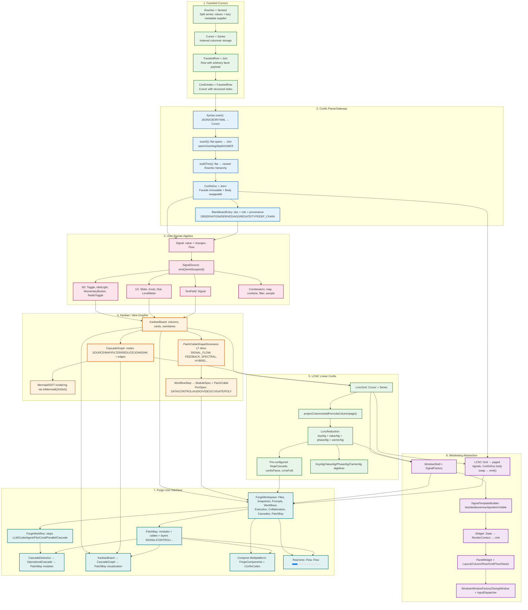
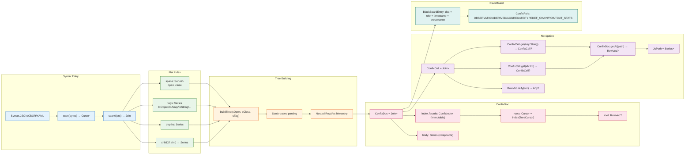
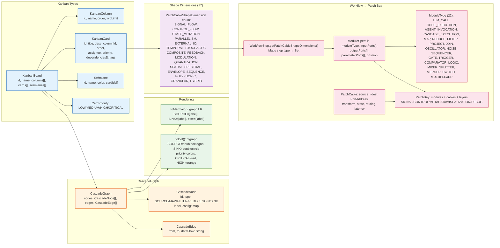
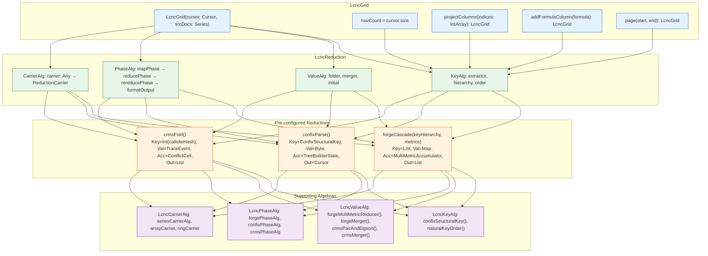

# TrikeShed Architecture - Mermaid Diagrams (Renderable)

---

## Complete End-to-End Flow

---

## Confix Parser Detail

---

## User Signals Algebra Detail

```mermaid
flowchart TB
    subgraph "Base Algebra"
        B1["Signal<T><br/>value: T<br/>changes: Flow<T>"]
        B2["map(transform) → Signal<R>"]
        B3["combine(other, combiner) → Signal<R>"]
        B4["filter(predicate) → Signal<T>"]
        B5["sample(interval) → Signal<T>"]
    end

    subgraph "Source Interface"
        SRC["SignalSource<T> : Signal<T><br/>emit(value): T<br/>emitSuspend(value): T"]
    end

    subgraph "Combinators (Internal)"
        COM1["MappedSignal<T,R>"]
        COM2["CombinedSignal<T,U,R>"]
        COM3["FilteredSignal<T>"]
        COM4["SampledSignal<T>"]
    end

    subgraph "0-Dimensional Signals"
        D01["Toggle: Signal<Boolean><br/>isOn, toggle(), turnOn(), turnOff()"]
        D02["IdiotLight: Signal<Boolean><br/>isLit, flash(), pulse()"]
        D03["MomentaryButton: Signal<Boolean><br/>isPressed, press(), release(), tap()"]
        D04["RadioToggle<T>: Signal<T><br/>selected, options[], select(), clear()"]
    end

    subgraph "1-Dimensional Signals"
        D11["Slider: Signal<Double><br/>min/max/step, normalized, setValue()"]
        D12["Knob: Signal<Double><br/>detents, radians, rotateBy(), snapToDetent()"]
        D13["Dial<T>: Signal<T><br/>positions[], index, next(), prev(), goto()"]
        D14["LevelMeter: Signal<Double><br/>level, peak, peakHoldMillis, setLevel()"]
    end

    subgraph "Text Signal"
        TXT["TextField: Signal<TextFieldState><br/>text, caret, selection, focused, committed<br/>insert/backspace/delete/moveCaret/setSelection/clear/commit"]
    end

    subgraph "Factory Functions"
        FAC["toggle() idiotLight() momentaryButton()<br/>radioToggle() slider() knob()<br/>dial() levelMeter() textField()"]
    end

    B1 --> SRC
    B1 --> B2
    B1 --> B3
    B1 --> B4
    B1 --> B5
    B2 --> COM1
    B3 --> COM2
    B4 --> COM3
    B5 --> COM4
    SRC --> D01
    SRC --> D02
    SRC --> D03
    SRC --> D04
    SRC --> D11
    SRC --> D12
    SRC --> D13
    SRC --> D14
    SRC --> TXT
    D01 --> FAC
    D02 --> FAC
    D03 --> FAC
    D04 --> FAC
    D11 --> FAC
    D12 --> FAC
    D13 --> FAC
    D14 --> FAC
    TXT --> FAC

    classDef base fill:#fce4ec,stroke:#c2185b;
    classDef comb fill:#f3e5f5,stroke:#7b1fa2;
    classDef d0 fill:#e3f2fd,stroke:#1565c0;
    classDef d1 fill:#e8f5e9,stroke:#2e7d32;
    classDef txt fill:#fff3e0,stroke:#e65100;
    classDef fac fill:#e0f2f1,stroke:#00695c;

    class B1,B2,B3,B4,B5 base;
    class SRC base;
    class COM1,COM2,COM3,COM4 comb;
    class D01,D02,D03,D04 d0;
    class D11,D12,D13,D14 d1;
    class TXT txt;
    class FAC fac;
```

---

## Kanban → CascadeGraph → Patch Bay

---

## LCNC Reduction Algebra

---

## Window Toolkit → Forge UI

```mermaid
flowchart LR
    subgraph "Window Toolkit Core"
        W1["WindowContextElement<br/>signalContextInstance + open/close"]
        W2["SignalContextElement<br/>SignalFactory + signal algebra"]
        W3["SignalFactory: toggle, light, button, radio,<br/>slider, knob, dial, level, textField"]
        W4["WindowShell: components + signals factory"]
    end

    subgraph "DSL"
        D1["windowContext(block) → WindowShell"]
        D2["panel(block) → SignalTemplate"]
        D3["SignalTemplateBuilder:<br/>template, beside, above, overlay, whenVisible"]
        D4["RenderPipeline / ConsoleRenderer:<br/>pipeline(), live(), quickTui()"]
    end

    subgraph "Widgets"
        WD1["Widget<T>: State → RenderContext → Unit"]
        WD2["PanelWidget: children[], Layout, padding"]
        WD3["Layout: Column/Row/Grid/Flow/Stack"]
        WD4["ToggleWidget, SliderWidget, KnobWidget,<br/>RadioWidget, LevelMeterWidget, TextFieldWidget"]
    end

    subgraph "Platform Windows"
        PW1["Window: title, size, position, open/close/resize/move"]
        PW2["WindowFactory: create(), createChild()"]
        PW3["SwingWindowFactory / SwingWindow"]
        PW4["InputDispatcher: Mouse/Key/Scroll → handlers"]
        PW5["RenderContext: drawRect, drawText, drawLine, drawCircle"]
    end

    subgraph "LCNC Integration"
        LI1["LCNC Grid → paged signals via cursor.page()"]
        LI2["LCNC reductions → Signal.map/combine transforms"]
        LI3["ConfixDoc.body swap → Signal.emit() zero-copy reload"]
        LI4["ConfixRole → signal metadata (OBSERVATION/DERIVED/...)"]
    end

    subgraph "Forge Core"
        FC1["ForgeWorkspace interface:<br/>Files, Snapshots, Prompts, Workflows, Execution,<br/>Collaboration, Cascades, PatchBay"]
        FC2["ForgeTypes: PatchCable, ModuleSpec, PatchBay,<br/>WorkflowStep, ForgeWorkflow, AgentType"]
        FC3["KanbanTypes: KanbanBoard ↔ CascadeGraph"]
    end

    subgraph "Forge UI (Compose)"
        FU1["ForgeComponents.kt: Compose UI components"]
        FU2["ConfixCodec.kt: Confix ↔ UI serialization"]
        FU3["Main.kt (JVM/JS): Entry points"]
    end

    subgraph "Bridge"
        BR1["SwingWindowFactory → Compose Desktop/Web"]
        BR2["InputDispatcher → Compose gesture system"]
        BR3["RenderContext → Compose Canvas/GraphicsLayer"]
        BR4["Widget<T> → @Composable functions"]
    end

    subgraph "Signal Flow in Forge"
        SF1["workspace.events(): Flow<CollaborationEvent>"]
        SF2["execute(): Flow<StepProgress>"]
        SF3["executeCascade(): Flow<CascadeProgress>"]
        SF4["streamPatchBay(): Flow<Map<String,String>>"]
        SF5["stream(fileId): ReceiveChannel<String>"]
    end

    W1 --> W2
    W2 --> W3
    W3 --> W4
    W4 --> D1
    D1 --> D2
    D2 --> D3
    D3 --> D4
    D4 --> WD1
    WD1 --> WD2
    WD2 --> WD3
    WD1 --> WD4
    WD4 --> PW1
    PW1 --> PW2
    PW2 --> PW3
    PW3 --> PW4
    PW4 --> PW5
    LI1 --> W4
    LI2 --> W4
    LI3 --> W2
    LI4 --> W3
    W4 --> FC1
    LI1 --> FC1
    LI3 --> FC1
    FC1 --> FC2
    FC1 --> FC3
    FC2 --> FU1
    FC3 --> FU1
    FU1 --> FU2
    FU2 --> FU3
    BR1 --> FU1
    BR2 --> FU1
    BR3 --> FU1
    BR4 --> FU1
    FC1 --> SF1
    FC1 --> SF2
    FC1 --> SF3
    FC1 --> SF4
    FC1 --> SF5
    FC2 --> SF1

    classDef core fill:#e3f2fd,stroke:#1565c0;
    classDef dsl fill:#e8f5e9,stroke:#2e7d32;
    classDef wdg fill:#fff3e0,stroke:#e65100;
    classDef plat fill:#fce4ec,stroke:#c2185b;
    classDef lcnc fill:#f3e5f5,stroke:#7b1fa2;
    classDef forge fill:#e0f2f1,stroke:#00695c;
    classDef fui fill:#f3e5f5,stroke:#7b1fa2;
    classDef br fill:#fff8e1,stroke:#f57f17;
    classDef sig fill:#e8f5e9,stroke:#2e7d32;

    class W1,W2,W3,W4 core;
    class D1,D2,D3,D4 dsl;
    class WD1,WD2,WD3,WD4 wdg;
    class PW1,PW2,PW3,PW4,PW5 plat;
    class LI1,LI2,LI3,LI4 lcnc;
    class FC1,FC2,FC3 forge;
    class FU1,FU2,FU3 fui;
    class BR1,BR2,BR3,BR4 br;
    class SF1,SF2,SF3,SF4,SF5 sig;
```

