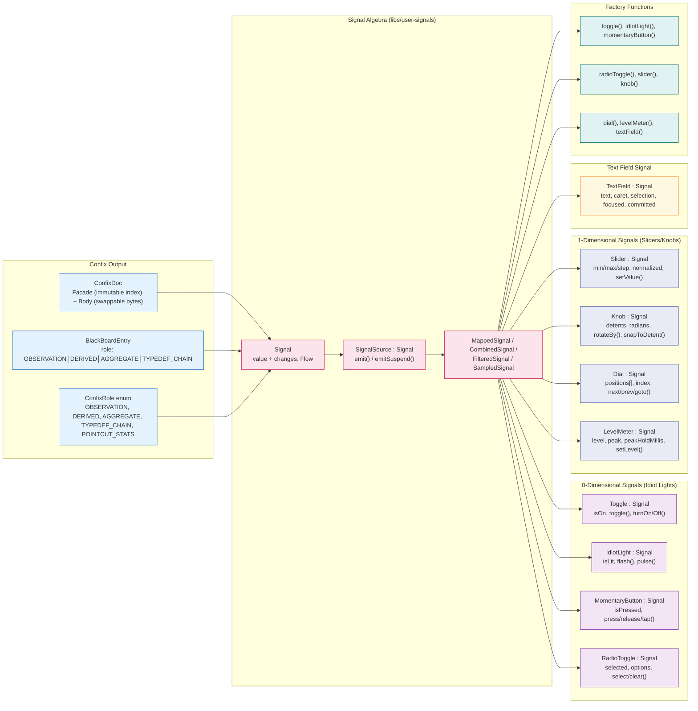
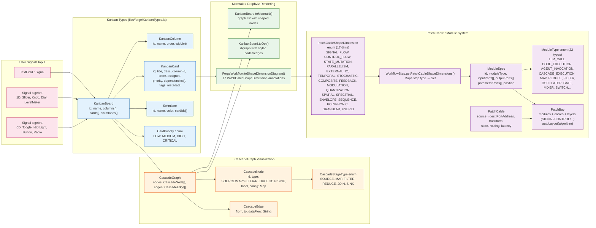
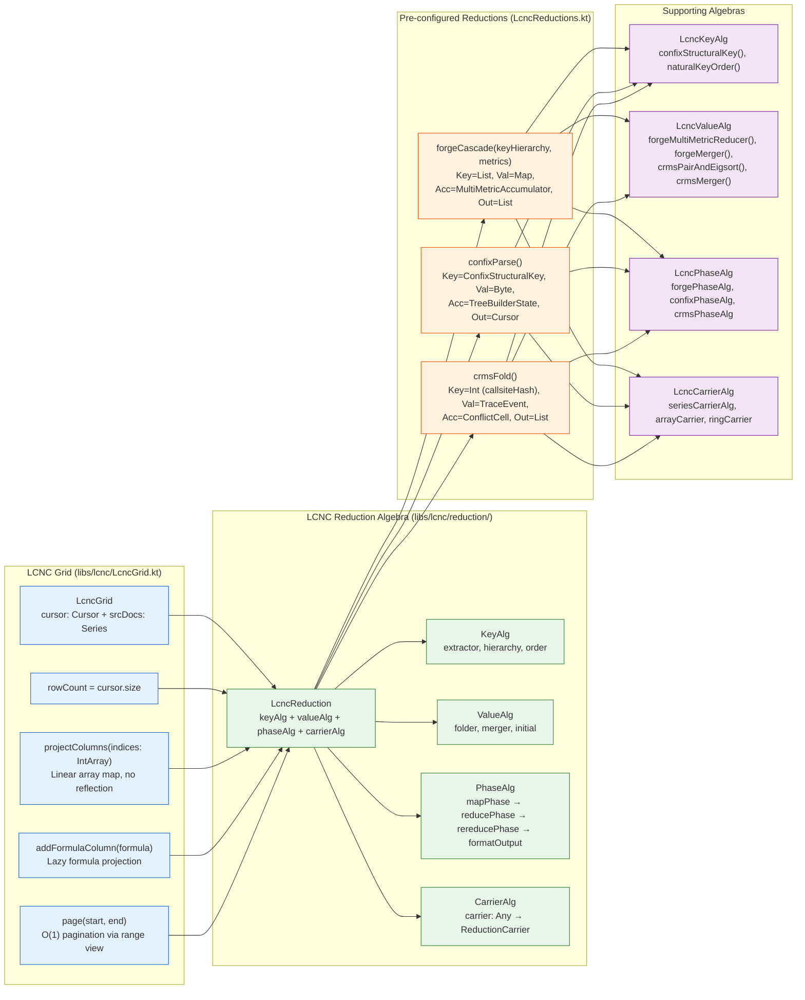
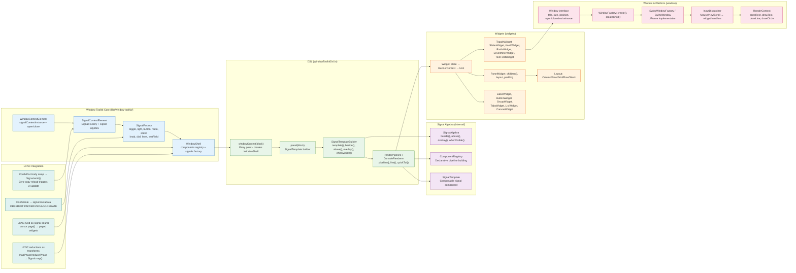
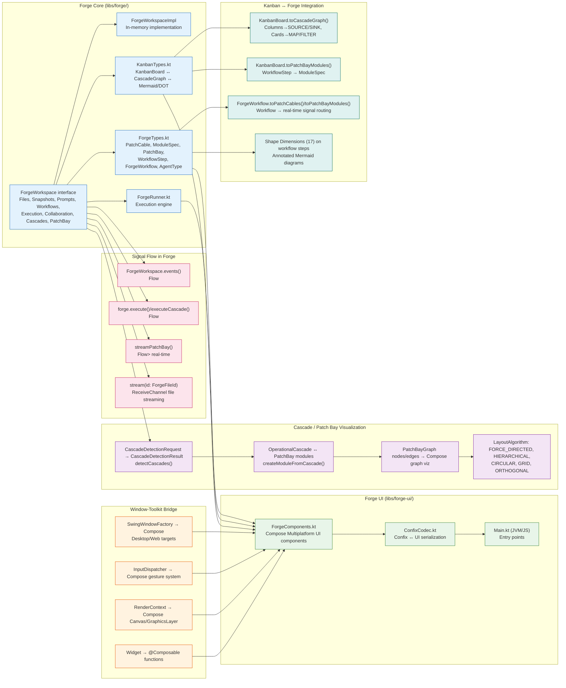
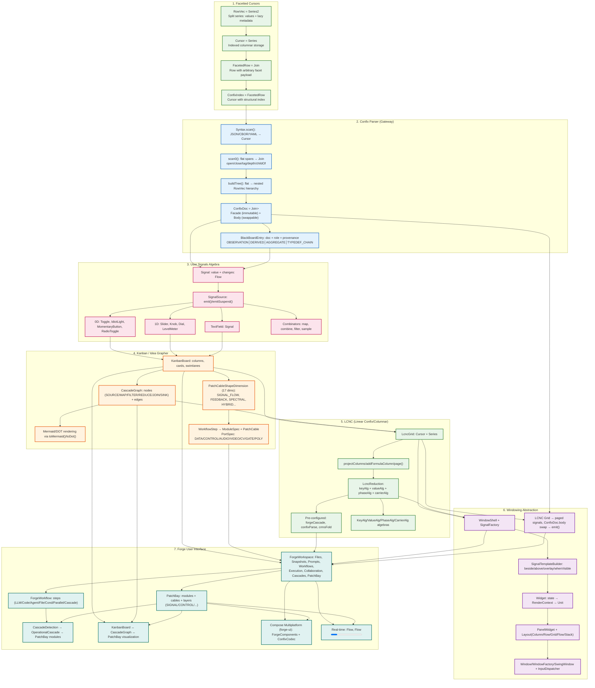

# TrikeShed Architecture Flow

## Overview
```
facetted-cursors → confix → user signals → kanban-idea-grapher → lcnc → windowing-abstraction → forge user interface
```

---

## 1. Facetted Cursors → Confix (Cursor Gateway)

```mermaid
flowchart LR
    subgraph "Facetted Cursors Layer"
        FC1["Multi-faceted RowVec<br/>(values + ColumnMeta↻ supplier)"]
        FC2["Cursor = Series<RowVec><br/>Indexed columnar storage"]
        FC3["FacetedRow = Join<RowVec, Any><br/>Row with lazy facets"]
        FC4["ConfixIndex = FacetedRow<Any><br/>Cursor with structural index"]
    end

    subgraph "Confix Parser (Cursor Gateway)"
        CP1["Syntax.scan()<br/>JSON / CBOR / YAML → Cursor"]
        CP2["scan0() → Join<Cursor, FlatIndex><br/>Span tree: open/close/tag/depth"]
        CP3["buildTree() → Cursor<br/>Nested RowVec hierarchy"]
        CP4["ConfixDoc = Join<ConfixIndex, Series<Byte>><br/>Facade + body (zero-copy reload)"]
    end

    subgraph "Navigation & Query"
        N1["ConfixCell = Join<RowVec, Series<Byte>><br/>Row + source bytes"]
        N2["RowVec.step(key/src) → RowVec?<br/>Object field / Array index"]
        N3["ConfixDoc.getAt(path) → RowVec<br/>Compound navigation"]
        N4["ConfixDoc.reify(tokenIdx) → Any<br/>Lazy materialization"]
        N5["JsPath = Series<Join<String, Int>><br/>Typed path segments"]
        N6["BlackBoardEntry<br/>doc + role + timestamp + provenance"]
    end

    FC1 --> CP1
    FC2 --> CP1
    FC3 --> CP4
    FC4 --> CP1
    CP1 --> CP2
    CP2 --> CP3
    CP3 --> CP4
    CP4 --> N1
    N1 --> N2
    N2 --> N3
    N3 --> N4
    N4 --> N5
    N5 --> N6

    classDef cursorLayer fill:#e8f5e9,stroke:#2e7d32,stroke-width:2px;
    classDef confixLayer fill:#e3f2fd,stroke:#1565c0,stroke-width:2px;
    classDef navLayer fill:#fff3e0,stroke:#e65100,stroke-width:2px;

    class FC1,FC2,FC3,FC4 cursorLayer;
    class CP1,CP2,CP3,CP4 confixLayer;
    class N1,N2,N3,N4,N5,N6 navLayer;
```



---

## 2. Confix → User Signals (Signal Algebra)



---

## 3. User Signals → Kanban / Idea Grapher



---

## 4. Kanban / Idea Grapher → LCNC (Linear Confix/Columnar)



---

## 5. LCNC → Windowing Abstraction (window-toolkit)



---

## 6. Windowing Abstraction → Forge User Interface



---

## Complete End-to-End Flow



---

## Key Data Flow Properties

| Layer | Core Type | Key Property |
|-------|-----------|--------------|
| **Facetted Cursors** | `RowVec = Series2<Any?, ColumnMeta↻>` | Split series: values + lazy metadata supplier |
| **Confix** | `ConfixDoc = Join<ConfixIndex, Series<Byte>>` | Facade (immutable index) + Body (zero-copy reload) |
| **User Signals** | `Signal<T> = { value: T, changes: Flow<T> }` | Composable algebra: map/combine/filter/sample |
| **Kanban/Idea Grapher** | `KanbanBoard → CascadeGraph` | Visualizable as Mermaid/DOT + PatchCable dimensions |
| **LCNC** | `LcncReduction<Key,Val,Acc,Out>` | Four-algebra map-reduce: key/value/phase/carrier |
| **Windowing** | `Widget<T>: State → RenderContext → Unit` | Signal-driven, platform-agnostic composition |
| **Forge UI** | `ForgeWorkspace + PatchBay` | Real-time collaboration, workflow execution, signal routing |

---

## Architecture Principles

1. **Confix as Cursor Gateway** — All structured tree parsing (JSON/CBOR/YAML) produces a `Cursor = Series<RowVec>` with `ConfixIndex` facade for navigation
2. **Zero-Copy Reload** — `ConfixDoc.body` swap preserves facade; triggers signal `emit()` for reactive UI
3. **Signal Algebra as Glue** — Every layer exposes `Signal<T>`; combinators enable cross-layer composition
4. **Map-Reduce Uniformity** — LCNC reductions unify Forge cascades, Confix parsing, CRMS folding under same algebra
5. **Patch Cable as Universal Routing** — Workflow steps ↔ Modules; Kanban cards ↔ Nodes; Signals ↔ Ports
6. **Platform-Agnostic Windowing** — `WindowToolkitDsl` builds signal trees; `SwingWindowFactory`/`Compose` are pluggable renderers
7. **Forge as Capstone** — Integrates all layers: files→ConfixDoc, workflows→PatchBay, cascades→LCNC reductions, UI→Signal-driven Compose