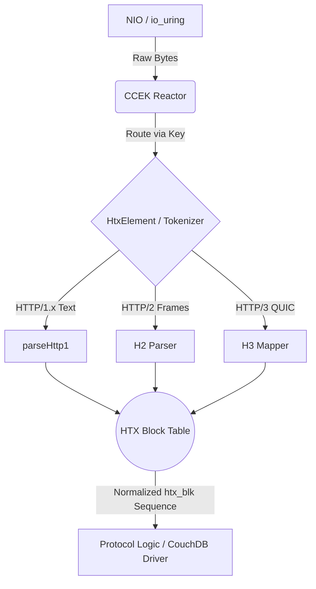

# Deep Dive: CCEK HTX Block Table and HTTP 1.5, 2, 3 as HAProxy htx_blk

## 1. Overview of HTX inside TrikeShed
In the TrikeShed architecture, HTTP operations are explicitly decoupled from transport protocols. The central abstraction for parsing and routing these protocols is **HTX**, a version-agnostic tokenizer that normalizes HTTP/1.x, HTTP/2, and HTTP/3 into a uniform block-based model inspired by HAProxy's internal `htx_blk` format.

This document explores how the **CCEK (Coroutine → Context → Element → Key)** architecture leverages the HTX model to construct the block table and route HTTP/1.5 (advanced HTTP/1.x features like WebSockets and keep-alive), HTTP/2, and HTTP/3 traffic.

## 2. The HAProxy `htx_blk` Model

At its core, `htx_blk` represents an HTTP message as a sequence of typed blocks. Instead of parsing strings (like HTTP/1.x) or binary frames (like HTTP/2/3) directly into sprawling object graphs, HTX decomposes all messages into linear `HtxBlock` elements.

An `HtxMessage` consists of:
- **`HtxStartLine`**: The request or response start line, containing the version (`Pair<Int, Int>`).
- **`HtxBlock` list**: Packed metadata (`type`, `nameLen`, `valueLen`, `addr`).
- **`DHTX_REQ`/`DHTX_RES`**: Special block types (codes 16-17) used to carry non-HTTP protocols within the same HTX framing.

### The Block Table Structure

The HTX message is serialized into a compact byte format:
`HTX_MAGIC(4) | flags(4) | blockCount(2) | [(type·len, data) × N] | CRC32(4)`

This binary structure enables zero-copy operations. The `addr` field in an `HtxBlock` acts as a ring offset into a shared `ByteRegion` buffer.

## 3. CCEK Subsumption of HTX

CCEK is the algebraic envelope that binds the IO, Reactor, Protocol, and Parser layers to execution scope. In the context of HTX:

1.  **Coroutine**: The asynchronous task handling the connection.
2.  **Context**: Holds the active state, such as `HtxElement` or `CouchElement`.
3.  **Element**: The active component managing the protocol lifecycle (an `AsyncContextElement` implementing the FSM: `CREATED → OPEN → ACTIVE → DRAINING → CLOSED`).
4.  **Key**: The singleton identity object used to look up the `Element` in the `Context`.

The parser (`parseHttp1`, H2 parser, H3 QUIC stream mapper) acts as the lower-level shape. CCEK *carries* this parser. When bytes arrive over NIO or io_uring, the CCEK Reactor routes them to the HTX tokenizer, which materializes the `htx_blk` sequence.

## 4. Protocol Unification: HTTP 1.5, 2, and 3

### HTTP/1.5 (Advanced HTTP/1.x)
"HTTP/1.5" conceptually refers to HTTP/1.1 with advanced features: chunked transfer encoding, keep-alive pipelining, and protocol upgrades (e.g., WebSockets).
- **Ingress**: `parseHttp1()` uses a trie-based method to detect the HTTP version and method.
- **HTX Mapping**: The raw text (`GET / HTTP/1.1\r\n`) is tokenized. The start line becomes an `HtxStartLine`. Headers become `HtxBlock`s of type Header. Chunked data becomes Data blocks.
- **CCEK Routing**: The megamorphic nature of HTTP/1.1 (keep-alive, pipelines) is managed by the CCEK Element's state machine, rather than a monolithic Reactor switch statement.

### HTTP/2
HTTP/2 is inherently a binary, frame-based protocol.
- **Ingress**: The connection preface (`PRI * HTTP/2.0\r\n\r\nSM\r\n\r\n`) is matched.
- **HTX Mapping**: HTTP/2 frames (HEADERS, DATA) are mapped directly onto `htx_blk` structures. The HPACK-decoded headers become Header blocks; DATA frames become Data blocks. The conceptual message is identical to HTTP/1.x.
- **CCEK Routing**: The multiplexed streams of HTTP/2 are handled by mapping each stream to a child Coroutine and Context, sharing the parent connection's Element.

### HTTP/3 (QUIC)
HTTP/3 operates over UDP using QUIC.
- **Ingress**: Handled by the `htx-general-client` via `QuicElement` (or the underlying UDP/uring transport).
- **HTX Mapping**: QPACK-decoded headers and stream data are translated into the universal `htx_blk` format.
- **CCEK Routing**: The QUIC transport natively maps to CCEK's async, multiplexed design. The `HtxElement` doesn't care that the underlying transport is UDP/QUIC; it only sees the normalized HTX blocks.

## 5. Flow Diagram: Request Processing

## 6. Non-HTTP Protocols (DHTX)

The design explicitly accommodates non-HTTP protocols (e.g., IPFS DHT routing, internal RPCs). These are marked with `HtxSlFlags.NOT_HTTP` and use the `DHTX_REQ`/`DHTX_RES` block types. Because they share the same HTX block table and CCEK routing, they seamlessly multiplex over the same IO channels and use the identical zero-copy infrastructure.
