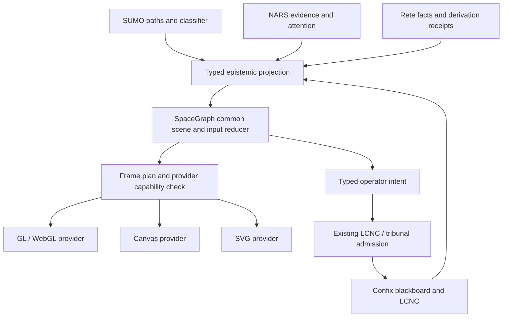

# SpaceGraph 7: Epistemic Surface and Multiplatform Port

Status: LCNC spatial workspace implementation in progress, 2026-09-07.
The common scene, measured LCNC extrusion, SVG projection, browser GL/Canvas/SVG
presenters and editor integration are implemented under `narchy.spacegraph`.
The full upstream port and desktop/native window providers are not complete.
The inventory remains a parity backlog, not a statement of implemented features.

The requested `autonull/spacegraph7` was not resolvable through GitHub or the
authenticated CLI. This design uses the apparent intended repository,
[autonull/spacegraphjs7](https://github.com/autonull/spacegraphjs7), pinned to
`ff74a475abd368746fe0db884c41052193e4b402`. TrikeShed was initially inspected at
`18c741c0f4ae3bf17bf6723149a0cfe57f18477c`.

## Spatial Workspace

- `/panels` opens the spatial workspace; `?spacegraph=0` opens the original
  editor. Both operate on the same LCNC objects, controls and undo history.
- `LcncExtrusion` lifts measured world-space bounds and own-port coordinates
  into Y-up solids. Containment determines Z separation. These are presentation
  values, not invented confidence or ontology coordinates.
- GL draws extruded surfaces using Three.js. Canvas and SVG consume a commonMain
  projection of those same solids, cables and camera values. They are projected
  backends, not hardware GL implementations.
- The parameter inspector temporarily hosts the original controls, preserving
  handlers and asynchronous picklists, with a dimension-preserving placeholder.
  Rich output views remain in the original editor.
- Rete, causal and KIF term matches are explicitly alignment candidates. Exact
  epistemic bindings remain absent unless supplied by an authoritative caller.
- Browser sources live in `src/commonMain/resources/web/narchy/spacegraph/`.
  Rebuild the checked-in browser bundle with `npm ci && npm run build` from
  this directory. The dependency versions are pinned; Three's MIT license is
  retained in the web vendor directory.

The IntelliJ strategy in `~/.codex/skills/intellij-counter-triage/SKILL.md` now
requires a verified semantic cycle, fresh focus between mutating steps, bounded
recovery, and explicit fallback disclosure. In this run IDE navigation worked,
but source selection failed; no successful semantic refactor is claimed.

Focused JVM verification: `LcncExtrusionTest` (6), `LcncRdfWireTest` (3), and
`RouteParityGate` (8) passed. Browser verification is recorded separately by
`src/jvmTest/js/spacegraph-browser.check.cjs`; compilation is not visual proof.

## Alignment With the Epistemic Model

SpaceGraph supplies the interactive projection of the
[epistemic tensor space](https://gist.github.com/autonull/b0a9ecf8bacdada7778a675c72702b80#iv-the-epistemic-tensor-space-unified-cognition).
It consumes admitted facts, belief evidence, rule receipts, and blackboard
documents through typed commonMain projections. Its layouts determine where a
fact is displayed; inference and evidence admission determine what the fact means.



| Existing authority | SpaceGraph projection | Required boundary |
| --- | --- | --- |
| `SumoClassifier`, `SumoOntology`, `AngularCodec` | Taxonomic groups, ontology facets, semantic navigation | Preserve ontology identifiers and the original angular word. A screen XYZ position cannot replace the ontology coordinate. |
| `SemanticSignal`, `EvidenceCoord`, `TruthCoord` | Belief nodes and support/refutation annotations | Derive frequency/confidence from evidence. Preserve provenance and evidence basis. |
| `BudgetCoord`, `BeliefBagElement` | Attention overlays, priority ordering, optional detail policy | Attention remains distinct from truth. Offscreen culling must not invoke belief forgetting. |
| `ReteStoredFact`, `FactId`, `CausalityReteElement` | Fact nodes, rule joins, support edges and firing animation | Stable fact identity and content version remain distinct; retraction removes the corresponding projection. |
| `BlackboardSurface`, `ConfixBlackboard` | Kanban, LCNC, and spatial views of the same document | A pure projector reads the cursor/document; local selection and camera state belong to the caller. |
| `TribunalNodes`, `CouncilCaseRegistry` | Contradiction cluster, case record, operator decision controls | Rendering a contradiction does not implement the propagation halt. Admission must enforce the affected-sector gate and record resolution. |

Proposed common contract: `EpistemicEdge = Join<OntologicalPath, TruthCoord>`
is a read projection. Its source record also carries evidence, attention,
stable identity, version CID, and derivation provenance. Do not introduce another
mutable store simply to realize the typealias. `Series` carries immutable scene
views, `Join` composes identity and presentation, and `Cursor` remains the board
projection boundary.

The 64-bit angular coordinate is a feature encoding. It is neither a unique
fact key nor a lossless XYZ embedding. A layout must retain source IDs so
collisions, aggregation, and reverse selection are explicit. Across a public JS
or JSON interface, encode packed Long values as decimal/hex strings, preserving
all bits rather than passing them through a JavaScript Number.

An illustrative view can group facts by SUMO class, annotate them with NARS
truth, and animate verified Rete firings. Such a visualization does not establish
a literal tensor calculus; numerical operators require separately specified
domains, units, and semantics.

## Measured Upstream Scope

The pinned Git tree has 529 files. There are 192 TypeScript source files under
`src/` (28,605 lines when counted by newline splitting) and 36 JS/TS/TSX/Vue
files under `packages/` (4,633 lines, including examples). The
[inventory](inventory.json) records every path and Git blob ID, including tests,
demos, assets, build files, and documentation. All entries start `pending`.

The source contains 47 modules under `src/nodes/`, including bases and the
barrel; `core/defaults.ts` registers 34 node types, 10 edge types, and 10 layout
plugins. The public exports and additional concrete nodes exceed the defaults.
The port inventory therefore follows source and exports, rather than README
feature counts. File-level inventory establishes scope, not behavioral parity.

| Upstream area | commonMain responsibility | Provider or integration work |
| --- | --- | --- |
| `types`, builders, `Graph`, registry, properties, computed properties | Typed graph specs, patches, atomic topology validation, builders, property dependency evaluation | JS facade and declaration generation preserve supported import/export shapes. |
| `Surface`, `Node`, spatial index, camera, render context | Parent transforms, bounds, hit testing, visibility, camera modes, LOD and nested graphs | Replace Three.js objects in contracts with portable geometry and opaque provider handles. |
| `actions`, history, event system, input and fingerings | Commands, undo/redo, selection, drag, resize, wire, hover, pinch, focus and gesture arbitration | DOM/native event normalization, pointer capture, keyboard, IME, clipboard and accessibility. |
| All layout plugins and container nodes | Circular, cluster, force, geo, grid, hierarchical, radial, spectral, timeline, tree; borders, split/stack/switch, sphere layout, scrolling, tabs and virtualization | Deterministic time/seed input; use existing compatible math where available; establish behavior against upstream fixtures. |
| Physics and animation | Port existing integration/constraints and easing into explicit, bounded ticks | Frame scheduling and presentation belong to the surface provider. No independent per-node timer loops. |
| Shape, instanced, textured, globe, scene and text mesh nodes | Geometry/material descriptions, transforms, batching plans and resource IDs | GL meshes/shaders, text shaping, texture/scene decoding, projected 2D representations. |
| All ten edge types | Routing, curves, labels, arrows, dash/flow phase, bundles and graph-qualified endpoints | Screen-space stroke widths; clipping across nested surfaces; GL tessellation and Canvas/SVG paths. |
| Widgets, notes, panels and data nodes | Value state, disabled/focus semantics, layout and typed actions | Provider painting plus accessible controls; focus, text editing and IME need real behavior. |
| DOM, HTML, iframe, code editor, markdown, math, charts | Content descriptors, editing commands and semantic state | Browser host integrations; desktop embedded web content or feature-equivalent native engines. |
| Image, audio, video and canvas nodes | Resource references, playback state, timeline and drawing command model | Decoders, audio devices, video frames and offscreen surfaces through platform SPIs. |
| HUD, minimap, zoom, color, ergonomics and vision overlays | Overlay models, transforms, theme tokens and analysis results | Separate world/HUD/embedded-content layers with consistent picking and capture. |
| Vision analyzers, heuristics, hybrid/ONNX strategy, auto-fixer | Analysis contract, heuristics, reports and proposed edits | Inference and model loading SPI; report backend, model identity, missing models and inference failure. |
| Mermaid/DOT/GraphML/JSON import | Supported grammar, diagnostics and conversion into graph specs | Reuse the existing parser libraries where applicable; fixtures define supported subsets. |
| n8n bridge and Langflow migrator | Workflow mapping, execution events, collaboration operations and node models | LCNC validation and userspace HTX transport; retain execution-monitor, HITL and timeline behavior. |
| React, Vue, Solid, CLI and project creator | Shared commands, configuration and schema | JS framework adapters and target launchers; account for packages explicitly in the parity ledger. |
| Tests, demos and assets | Portable scenarios and expected semantic results | Port interactive scenarios and capture actual provider output; retain required upstream MIT notices. |

## Rendering and Surface Contracts

Place the portable renderer contract under
`src/commonMain/kotlin/narchy/spacegraph/graphics/spi/`. SpaceGraph-specific
scene logic belongs under `narchy/spacegraph/`. Extend or adapt
`ManimWmSpi` to the shared graphics/surface operations so both consumers use one
provider family. The existing Manim camera and scene types are reuse candidates;
their present 2D types do not establish full 3D or DOM support.

The inspected `JvmManimWmSpi` only prints lifecycle events. It does not create a
window or draw pixels, and cannot count as the desktop implementation.

| Contract | Portable values and behavior |
| --- | --- |
| `GraphicsOperations` | Capability probe, create surface, resize, submit immutable frame, capture, release resources, close. Results distinguish supported, degraded and unavailable. |
| `SurfaceOperations` | Logical and framebuffer dimensions, pixel ratio, visibility, input events, frame availability and context loss/restoration. Adapt the existing window SPI. |
| `FramePlan` | Camera, viewport, clip hierarchy, world primitives, HUD primitives and content placements. Stable IDs connect draw items to graph entities. |
| `ResourceOperations` | Mesh, image, font, shader and content references; explicit ownership and bounded release. Fetch/file/process work uses existing userspace SPIs. |
| `TextOperations` | Shaping, measurement, line breaks, glyph runs, selection, accessibility text and IME composition. Include font identity in parity fixtures. |
| `ContentOperations` | Embedded HTML/editor/media creation, updates, focus and disposal. Support is negotiated separately from the drawing backend. |
| `InferenceOperations` | Model bytes/identity, tensor data, named results, cancellation and unavailable/error outcomes. |

Start with portable 2D primitives, paths, glyph runs, images, transforms and clips,
plus a separate mesh/material branch for 3D. Forcing every backend through GL
commands would prevent a usable Canvas or SVG implementation. Keep tessellation
and shader dialect selection within GL providers; keep an SVG document writer
pure commonMain code. File writes and rasterization remain provider operations.

Capability fields must distinguish `paths2d`, `text`, `images`, `mesh3d`,
`instancing`, `dom`, `editableText`, `audio`, `video`, `capture`, and `inference`.
A selected profile requests capabilities and an explicit degradation policy.
Return the actual selected backend and any unsupported scene items before
presenting success. Profile names alone do not prove hardware acceleration.

Canvas and SVG preserve common graph/input/layout behavior for supported 2D
content. A projected or rasterized 3D object must be reported as such. A flat
SVG export cannot promise interactive iframe, editor, audio/video, or arbitrary
3D parity. Full desktop parity requires the missing content providers; an
unsupported result is truthful progress but does not close that feature.

Use `SpaceGraphElement : AsyncContextElement` with a bounded command channel and
the complete CREATED -> OPEN -> ACTIVE -> DRAINING -> CLOSED lifecycle. Scope
registries and cross-graph resolution to the caller's workspace. Avoid the
upstream process-global instance search, which can resolve identical node IDs
in unrelated boards. Render caches and interaction state may be mutable inside
their owner; blackboard adapters stay pure.

A composition root installs platform providers. UI callbacks enqueue portable
events; the CCEK owner serializes updates and submits immutable frames. Frame
requests may coalesce, but pointer releases and commands must not silently drop.
Drain accepted work before releasing resources. Suspend submission is not proof
of nonblocking execution: GPU waits, image decoding and file access need the
appropriate provider dispatcher, cancellation and deadlines.

GL context affinity and macOS UI main-thread requirements are explicit provider
constraints. Establish the platform event pump and reactor dispatcher at the
single main entry point. Do not use nested runBlocking or move an arbitrary
thread-affine context onto Dispatchers.IO. Context loss invalidates GPU handles
and rebuilds from scene/resource state without changing admitted facts.

## Source Sets and Target Profiles

`commonMain` and `nativeMain` are shared source sets, not runnable targets.
TrikeShed currently declares JVM, one JS target with browser and Node environments,
Wasm/JS, and host-selected Native targets. `macos` is specifically macosArm64;
Linux is linuxX64; MinGW is host/property selected. Preserve that topology and
the current Kotlin/JDK versions while adding the graphics feature.

| Source location | Contents |
| --- | --- |
| `src/commonMain/kotlin/narchy/spacegraph/` | Graph, camera/input reducers, layouts, scene projection, resources as values, SVG encoding, capability selection. |
| `src/commonMain/kotlin/narchy/spacegraph/graphics/spi/` | Shared operations and portable errors; no Three.js, DOM, JDK or C pointer types. |
| `src/jsMain/kotlin/narchy/spacegraph/graphics/spi/` | Browser Canvas/SVG adapters and portable JS binding helpers; no module-load DOM access. |
| `src/spacegraphBrowserMain/kotlin/narchy/spacegraph/` | Proposed custom JS compilation source set for the Three.js adapter, DOM/editor/media integrations and browser entry point. |
| `src/spacegraphNodeMain/kotlin/narchy/spacegraph/` | Proposed custom JS compilation source set for headless SVG/analysis and CLI, with no browser provider imports. |
| `src/jvmMain/kotlin/narchy/spacegraph/graphics/spi/` | Skia/Skiko Canvas adapter, optional LWJGL GL/window provider and JVM content/inference backends. |
| `src/nativeMain/kotlin/narchy/spacegraph/` | Shared Native composition and capability handling. Platform C types stay in concrete backend source sets. |
| `src/macosMain/`, `src/linuxMain/`, `src/mingwX64Main/` | Native surface, GL, Canvas, text, content and inference implementations; target-specific cinterop and linker settings. |
| `src/wasmJsMain/` | Existing target must keep compiling. Rich Wasm graphics requires its own interop implementation and is additional scope beyond JS. |

The custom JS compilations need explicit commonMain dependencies and their own
bundling/run tasks. A directory named browserMain alone creates no isolation;
associating a Node compilation with a DOM-dependent main output would import
that dependency. Inspect generated imports and run Node with no document/window
globals. Prove the Kotlin 2.4.10 packaging setup before committing to its DSL.
See Kotlin's [custom compilation contract](https://kotlinlang.org/docs/multiplatform/multiplatform-configure-compilations.html).

The profile families below separate renderer choices from Native platform
settings. Typed profile loading and dedicated Gradle wiring are still pending;
this table is not a set of runnable target configurations.

| Profile family | Implementation choice | Configuration that differs |
| --- | --- | --- |
| Browser GL | Three.js WebGL provider and optional DOM overlay | Pinned npm dependencies, ES modules, shader/assets, pixel ratio, context loss, browser frame/input hooks. |
| Browser Canvas | CanvasRenderingContext2D | Canvas size/DPR, paths and text metrics; DOM content is an independently selected overlay. |
| Browser SVG | DOM SVG presenter over common scene projection | Namespace, clip IDs, viewBox, pointer targets and accessibility; export can use the common writer. |
| Node SVG | Common SVG writer plus portable resource access | Node entry point, explicit viewport/fonts and deterministic timestamps; no display or GPU dependency. |
| JVM GL | LWJGL OpenGL/GLFW backend | OS/CPU-specific native artifacts, context profile and UI-thread affinity; dedicated launcher/runtime dependencies. |
| JVM Canvas | Existing Skiko/Skia stack | Actual Skia backend and host artifact, surface attachment, text metrics and screenshot readback. |
| JVM SVG | Common SVG writer | Headless launcher and userspace file output; omit native graphics dependencies from its staged distribution. |
| Native GL | GLFW plus OpenGL bindings | Host cinterop, proc-address loading, SDK/library search paths, native event pump and context version. |
| Native Canvas | Cairo/Pango backend candidate | Pinned C libraries, text shaping, image decoding and window-surface integration; verify each host ABI before adoption. |
| Native SVG | Common SVG writer | Native executable entry point and userspace output; no display-library link requirement. |

GL uses a feature subset implemented by WebGL2 and desktop GL core, with separate
GLSL ES and desktop shader sources. Detect capabilities instead of passing GLSL
unchanged between APIs. macOS needs its own core-profile context configuration;
GLFW documents the platform's [OpenGL constraints](https://www.glfw.org/docs/latest/compat_guide.html#compat_osx).
Skiko already enters this repository through Compose Desktop; evaluate that
dependency before adding another JVM raster stack. Its
[published platform support](https://github.com/JetBrains/skiko) does not prove
that the same artifact serves every Kotlin/Native target.

The build implementation must isolate optional graphics dependencies and native
link inputs per profile/compilation. It must not stage LWJGL, Cairo or web content
engines into a headless SVG executable. Native builds need explicit OS, CPU,
display system, SDK/sysroot, headers, library paths and deployment target.
Resolve those through toolchains/properties, never checked-in developer paths.
Keep host-selected defaults; use the existing Linux/MinGW opt-ins for CI.

## Implementation Order and Acceptance

1. Freeze scope at the pinned revision. Expand each pending runtime file into
   public exports/behaviors, target mappings and fixture references. Preserve
   MIT attribution when code/assets are incorporated. Record upstream defects
   separately from compatible behavior.
2. Port typed graph/spec/action/property and transform contracts into commonMain.
   Verify topology mutations, nested/group-qualified identity, retraction,
   serialization round trips and 64-bit precision across JVM, JS and host Native.
3. Implement common frame projection and SVG export, then browser SVG and Canvas.
   Deliver a visible graph with labels, edges, selection, drag, resize, pan/zoom,
   nesting and disposal. Wire actual target entry points and profile parsing.
4. Implement browser GL with Three.js and desktop GL/Canvas providers. Use the
   same graph fixtures to verify transforms, clipping, hit tests, text/image
   rendering, resource release and context restoration on real surfaces.
5. Complete all node/edge variants, layout containers, ten layout plugins,
   physics, animation, history, minimap/HUD and nested inter-graph edges. Add the
   rich-content, media, accessibility and editing providers required for parity.
6. Connect SUMO/NARS/Rete/Confix projections and typed LCNC/tribunal intents.
   Retain specialized `/graal`, `/panels`, and blackboard views. Validate the
   authoritative change and receipt after a UI action, including rejection.
7. Port workflow/framework/CLI integrations and vision. Complete the target
   distributions and runtime parity ledger, then retire upstream runtime code
   only for behaviors covered by the Kotlin implementation.

For every ported feature, record upstream path/export, Kotlin implementation,
provider/profile, fixture, command, actual observed result and evidence path.
`pending`, `implemented`, `compiled`, and `runtime-verified` are distinct states.
An approved deliberate behavior change needs its rationale and replacement
acceptance scenario. No-op providers, registry entries and screenshots from
upstream do not count as runtime verification of the port.

The upstream ONNX strategy currently supplies success-like defaults when some
models are missing, and the repository includes dummy model generators. Inspect
model artifacts and provenance before making inference-quality claims. The port
must report missing models and failed inference explicitly; heuristic results
must identify the heuristic backend. This is also required by the epistemic
boundary: a visualization quality score cannot become admitted evidence merely
because a provider returned it.

The existing production build gate remains:

```sh
./gradlew jvmMainClasses --console=plain
```

That gate verifies neither JS/Native compilation nor graphics parity. Additional
feature verification must compile JS and the enabled Native target, link and run
the selected executable, and exercise every claimed provider. Proposed custom
profile tasks do not exist yet. Keep the current target-debt ratchets visible;
never add SpaceGraph exclusions to obtain a passing portability claim.

Use common semantic tests for actions, topology, projections and deterministic
layout; use actual provider surfaces for painting/input evidence. Browser checks
cover desktop and mobile viewports, nonblank canvas pixels, loaded assets,
readable text, zoom, drag, nested clipping and teardown. JVM/Native checks need
visible windows and readback/input evidence; SVG checks need parsed output and
a rendered artifact. Include empty graphs, Unicode/IME, missing assets, context
loss, headless mode and provider refusal. Visual equivalence may use explicit
tolerances for raster/text differences; identity and command semantics must match.

Completion means the full inventory is accounted for, all requested targets have
real implementations, and required feature/provider combinations have observed
parity. Canvas/SVG limitations and unfinished desktop content providers remain
visible gaps until resolved. This document completes the expanded alignment
design, not that implementation.
