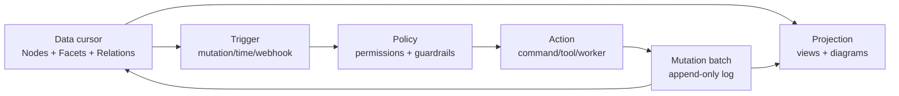

# Notion → LCNC Reusable Primitives

> Reverse pass over the June 2026 Notion feature brief. The goal is **not** to copy Notion features one-for-one; it is to distill reusable LCNC primitives that can support a CursorDriven Notion app, Mail, Calendar, Sites, agents, admin consoles, and future Forge workflow surfaces.

**Repo context:**
- Existing app slice: `libs/forge/src/main/kotlin/borg/trikeshed/forge/notion/`
- Existing LCNC seed: `libs/lcnc/src/commonMain/kotlin/borg/trikeshed/lcnc/LcncGrid.kt`
- Existing Forge primitives: files, snapshots, prompts, workflows, agents, cascades, collaboration, artifacts.
- Kernel shape: `Cursor = Series<RowVec>`, `Series<T> = Join<Int, (Int) -> T>`, LCNC grids are cursor-native.

---

## 0. Design Rule

Every Notion-ish capability should collapse into one of these reusable axes:

```text
Scope       who/where this exists
Node        nested content/document graph
Facet       metadata/properties over nodes or rows
Cursor      active address / ordered projection
View        presentation/query over a cursor
Mutation    command/event that transforms state
Action      reusable tool/workflow/automation step
Policy      permission/guardrail/quota/security rule
Sync        collaboration/offline/external-source movement
```

If a feature does not fit one of these axes, it is probably UI chrome, not an LCNC primitive.

---

## 1. Reverse pass through the product brief

### 11. Administration, security, and plan differences

**Product surface:** plans, seats, guests, SSO/SCIM, audit logs, agent guardrails, credit limits, page/teamspace/database permissions.

**Reusable LCNC primitives:**

| Primitive | Reusable meaning | Kernel shape |
|---|---|---|
| `LcncPrincipal` | user, guest, bot, service account, external identity | id + facets |
| `LcncScope` | workspace/teamspace/page/database/row/block boundary | node id + scope kind |
| `LcncPolicy` | permission rule over scope/action/principal | faceted row |
| `LcncPlanLimit` | feature/quota gate: upload size, guests, history, agents | policy facet |
| `LcncAuditEvent` | append-only admin/security event | mutation row |
| `LcncGuardrail` | agent-specific allowed tools, approval gates, credit budget | policy + action facet |

**Reuse targets:** Notion clone permissions, Forge agent controls, public Sites publishing, external connector OAuth scopes.

---

### 10. Platforms and access

**Product surface:** web/desktop/mobile, offline pages, recents/favorites auto-download, sync.

**Reusable LCNC primitives:**

| Primitive | Reusable meaning | Kernel shape |
|---|---|---|
| `LcncReplica` | local/offline materialized subset of workspace cursors | scope + cursor checkpoint |
| `LcncSyncCursor` | ordered stream of mutations per replica | `Series<LcncMutation>` |
| `LcncCachePolicy` | favorites/recents/pinned/offline rules | policy facet |
| `LcncDeviceSurface` | web/desktop/mobile layout capability | principal/device facets |

**Reuse targets:** offline documents, mobile home tab, local agent cache, sync-any-data-source.

---

### 9. Templates, learning, ecosystem

**Product surface:** page templates, database templates, template buttons, community gallery.

**Reusable LCNC primitives:**

| Primitive | Reusable meaning | Kernel shape |
|---|---|---|
| `LcncTemplate` | parameterized node graph + facets + initial mutations | artifact + action |
| `LcncTemplateSlot` | typed hole in template | facet schema |
| `LcncTemplateInstantiation` | mutation batch created from template | mutation transaction |
| `LcncGalleryItem` | sharable template/artifact metadata | row in catalog cursor |

**Reuse targets:** page templates, database row templates, workflow recipes, agent tools, published starter kits.

---

### 8. Automation, extensibility, developer platform

**Product surface:** agents, workers, webhooks, API, Markdown API, custom tools, bidirectional triggers, sync external data.

**Reusable LCNC primitives:**

| Primitive | Reusable meaning | Existing Forge overlap |
|---|---|---|
| `LcncAction` | callable command/tool with typed inputs/outputs | `WorkflowStep` |
| `LcncTrigger` | event predicate that starts an action | workflow/cascade source |
| `LcncWorker` | hosted/runtime action executor | `AgentInvocation`, `CodeExecution` |
| `LcncConnector` | external data/tool binding with auth + mapping | future Forge connector |
| `LcncWebhook` | inbound/outbound event transport | collaboration/event stream |
| `LcncExternalCursor` | synced source projected as rows | `CascadeSource.CursorSource` |
| `LcncMarkdownCodec` | import/export codec for node graph | `ForgeFile`/artifact |

**Reuse targets:** Notion Workers, custom agent tools, Slack/Zendesk/Salesforce sync, Markdown API, task automation.

---

### 7. Extended ecosystem: Calendar, Mail, Sites

**Product surface:** calendar overlay, database dates as events, scheduling, AI mail, custom email views, public sites.

**Reusable LCNC primitives:**

| Primitive | Reusable meaning | Kernel shape |
|---|---|---|
| `LcncTemporalEvent` | date/time interval over any row/block | row facet: start/end/timezone |
| `LcncMessage` | email/message/thread entity | node + facets |
| `LcncConversation` | grouped messages by relation/thread key | relation graph |
| `LcncLabelRule` | filter/action automation for mail-like streams | trigger + action |
| `LcncRoute` | public URL route to a page/view/artifact | site facet |
| `LcncPublication` | materialized public page/database/site bundle | artifact + policy |

**Reuse targets:** Notion Calendar, Notion Mail, Sites, inbox-style task views, changelog/public docs.

---

### 6. Collaboration and sharing

**Product surface:** real-time editing, comments, mentions, guests, public links, granular permissions, page verification.

**Reusable LCNC primitives:**

| Primitive | Reusable meaning | Existing Forge overlap |
|---|---|---|
| `LcncPresence` | actor cursor/selection/status | `CollaborationEvent.CursorPosition` |
| `LcncCommentThread` | thread anchored to node/range/row | node + anchor facet |
| `LcncMention` | typed reference to user/page/date/row | inline token facet |
| `LcncShareLink` | public/guest/member access token | policy + route |
| `LcncVerification` | official/source-of-truth stamp | node facet + audit event |
| `LcncMutationBatch` | atomic collaborative operation group | `Series<LcncMutation>` |

**Reuse targets:** collaborative docs, database row comments, agent approval comments, public site verification.

---

### 5. Organization, navigation, and discovery

**Product surface:** sidebar, recents, favorites, breadcrumbs, backlinks, global/AI search, linked references.

**Reusable LCNC primitives:**

| Primitive | Reusable meaning | Kernel shape |
|---|---|---|
| `LcncNavTree` | ordered scope/page tree projection | cursor view over nodes |
| `LcncBreadcrumb` | ancestor chain from focused node | path facet |
| `LcncBacklink` | reverse edge index from mentions/relations | relation cursor |
| `LcncSavedSet` | favorites/recents/pins/history | principal-scoped cursor |
| `LcncSearchIndex` | lexical/vector/AI searchable projection | external cursor + action |
| `LcncHomeView` | per-principal dashboard composed from saved sets | view spec |

**Reuse targets:** sidebars, quick find, AI Q&A source retrieval, mobile Home.

---

### 4. AI-powered intelligence layer

**Product surface:** writing assistant, Q&A, Notion Agent, custom agents, plan mode, meeting notes, enterprise search, AI analytics.

**Reusable LCNC primitives:**

| Primitive | Reusable meaning | Existing Forge overlap |
|---|---|---|
| `LcncPrompt` | reusable prompt template with typed params | `ForgePrompt` |
| `LcncAgent` | autonomous actor with tools, budget, scope | `AgentConfig`, `AgentType` |
| `LcncPlan` | proposed mutation/action graph before execution | `ForgeWorkflow` draft |
| `LcncApprovalGate` | pause point requiring human confirm/clarify | guardrail + workflow step |
| `LcncKnowledgeAnswer` | sourced answer over workspace/search cursor | artifact + citations |
| `LcncAiAutofill` | generated property value for a row/block | action writes facet |
| `LcncUsageMetric` | token/credit/action/cost event | audit/analytics cursor |
| `LcncMeetingCapture` | transcript + summary + tasks as node graph | message/doc/action bundle |

**Reuse targets:** Q&A agents, custom agents, workflow plans, meeting notes, property autofill, AI usage dashboards.

---

### 3. Databases and structured data

**Product surface:** full-page/inline databases, views, properties, relations, rollups, formulas, filters, sorts, grouping, templates.

**Reusable LCNC primitives:**

| Primitive | Reusable meaning | Current status |
|---|---|---|
| `LcncGrid` | cursor-native table/grid projection | exists, minimal |
| `LcncSchema` | ordered property/column definitions | partially in `NotionDatabaseSchema` |
| `LcncField` | property definition with type/options/defaults | partially in `NotionDatabaseField` |
| `LcncRow` | projected row with title + cells + source block/doc | partially in `NotionDatabaseRow` |
| `LcncViewSpec` | table/board/list/calendar/gallery/timeline with filters/sorts/groups/hidden cols | not yet generalized |
| `LcncFilter` | predicate over row facets | partially in `NotionDatabaseFilter` |
| `LcncSort` | comparator over row facets | partially in `NotionDatabaseSort` |
| `LcncGroup` | grouped cursor by field/expression | missing |
| `LcncRelation` | typed edge between rows/nodes across grids | missing |
| `LcncRollup` | aggregate over relation traversal | missing; maps to cascades/reduce |
| `LcncFormula` | expression AST compiled to row transducer | stub-like `addFormulaColumn` exists |
| `LcncDatabaseTemplate` | row/page mutation batch template | missing |

**Reuse targets:** Notion databases, Mail views, Calendar overlays, admin tables, agent work queues, external synced sources.

**Important consolidation:** move generic schema/query/view pieces out of `forge/notion` into `libs/lcnc`; keep Notion naming as adapter aliases.

---

### 2. Content creation and editing blocks

**Product surface:** basic blocks, media/embeds, structural blocks, synced blocks, columns, inline mentions/dates/reminders.

**Reusable LCNC primitives:**

| Primitive | Reusable meaning | Current status |
|---|---|---|
| `LcncNode` | typed graph node: page/block/row/message/event | partially `NotionBlock` |
| `LcncNodeKind` | pluggable kind registry, not Notion-only enum | partially `NotionBlockKind` |
| `LcncChildOrder` | stable ordered child sequence per parent | `children: List<NotionBlockId>` |
| `LcncInlineToken` | mark/mention/date/equation/code span inside text | missing |
| `LcncAssetRef` | image/video/audio/file/pdf/blob/embed reference | missing |
| `LcncEmbedRef` | external app embed with provider/url/config | missing |
| `LcncLayout` | columns, callouts, toggles, tables as layout facets | partially node kind/properties |
| `LcncSyncedNode` | content-addressed mirror of a node subtree | missing |
| `LcncRenderHint` | UI-specific presentation without changing data | missing |

**Reuse targets:** pages, mail bodies, calendar descriptions, site rendering, agent-generated documents.

---

### 1. Foundational architecture

**Product surface:** workspaces, teamspaces, infinitely nested pages, draggable blocks, public sites/templates.

**Reusable LCNC primitives:**

| Primitive | Reusable meaning | Current status |
|---|---|---|
| `LcncWorkspace` | top-level scope with principals/policies/sync state | Forge workspace exists, not LCNC generic |
| `LcncSpace` | teamspace/project/container scope | missing |
| `LcncNodeStore` | immutable-ish map of node id -> node | `CursorNotionState.blocks` |
| `LcncCursorAddress` | actor/page/block/text/range focus | `NotionCursor` |
| `LcncCommand` | pure mutation command over cursor/state | `NotionCommand` |
| `LcncMutation` | durable append-only operation record | `NotionMutation` |
| `LcncProjection` | materialized/lazy cursor view from node graph | `NotionCursorView` |

**Reuse targets:** everything. This is the base layer for documents, databases, mail, calendar, sites, and agents.

---

## 2. De-duplicated LCNC primitive set

### Core graph and cursor

```text
LcncId
LcncWorkspace / LcncSpace / LcncScope
LcncNode / LcncNodeKind / LcncNodeStore
LcncCursorAddress / LcncSelection
LcncProjection<T>
LcncMutation / LcncMutationBatch
LcncCommand
```

### Grid/database layer

```text
LcncGrid
LcncSchema
LcncField
LcncRow
LcncCell
LcncViewSpec
LcncFilter
LcncSort
LcncGroup
LcncFormula
LcncRelation
LcncRollup
LcncTemplate
```

### Content/rendering layer

```text
LcncInlineToken
LcncAssetRef
LcncEmbedRef
LcncLayout
LcncRenderHint
LcncPublication
LcncRoute
```

### Collaboration/navigation/search

```text
LcncPresence
LcncCommentThread
LcncMention
LcncBacklink
LcncBreadcrumb
LcncNavTree
LcncSavedSet
LcncSearchIndex
```

### Automation/AI/developer platform

```text
LcncAction
LcncTrigger
LcncWorker
LcncConnector
LcncExternalCursor
LcncPrompt
LcncAgent
LcncPlan
LcncApprovalGate
LcncUsageMetric
```

### Admin/sync/security

```text
LcncPrincipal
LcncPolicy
LcncPlanLimit
LcncGuardrail
LcncAuditEvent
LcncReplica
LcncSyncCursor
LcncCachePolicy
```

---

## 3. Reuse map: one primitive, many products

| Primitive | Notion docs | Databases | AI agents | Mail | Calendar | Sites | Admin |
|---|---:|---:|---:|---:|---:|---:|---:|
| `LcncNode` | yes | rows as nodes | context docs | messages | event notes | pages | policy anchors |
| `LcncGrid` | tables | yes | work queues | inbox views | event overlays | public DBs | dashboards |
| `LcncViewSpec` | inline views | yes | task queues | labels/views | week/month | site pages | audit views |
| `LcncRelation` | backlinks | relations | tool/context edges | thread links | attendee links | nav links | ownership |
| `LcncFormula` | inline calc | formulas | routing rules | mail rules | availability | computed metadata | limits |
| `LcncAction` | slash commands | row actions | tools | mail rules | scheduling | publishing | automation |
| `LcncPolicy` | sharing | row perms | guardrails | mailbox ACL | calendar ACL | public links | plan gates |
| `LcncSyncCursor` | offline | external sync | memory refresh | IMAP sync | calendar sync | publish sync | audit stream |

---

## 4. Proposed implementation order

This keeps the current CursorDriven Notion slice useful while pushing reusable pieces down into `libs/lcnc`.

### Phase A — Extract generic node/cursor primitives

Move the Notion-neutral parts of `CursorDrivenNotion.kt` into LCNC:

```text
libs/lcnc/src/commonMain/kotlin/borg/trikeshed/lcnc/LcncNode.kt
libs/lcnc/src/commonMain/kotlin/borg/trikeshed/lcnc/LcncCursor.kt
libs/lcnc/src/commonMain/kotlin/borg/trikeshed/lcnc/LcncMutation.kt
libs/lcnc/src/commonMain/kotlin/borg/trikeshed/lcnc/LcncCommand.kt
```

Keep `forge/notion` as an adapter:

```text
NotionBlock     -> wraps/aliases LcncNode
NotionCursor    -> wraps/aliases LcncCursorAddress
NotionCommand   -> Notion-specific command vocabulary over LcncCommand
```

### Phase B — Promote database/query to LCNC grid

Move the Notion-neutral parts of `CursorDrivenNotionDatabase.kt` into LCNC:

```text
LcncSchema
LcncField
LcncRow
LcncViewSpec
LcncFilter
LcncSort
LcncGroup
```

Then make Notion database code an adapter over `LcncGrid`.

### Phase C — Add relation/rollup/formula as real reusable primitives

```text
LcncRelation = typed directed edge between two row/node ids
LcncRollup   = aggregation over relation traversal
LcncFormula  = expression AST -> row/cell transducer
```

Rollups should reuse `OperationalCascade` where possible:

```text
Relation traversal -> CascadeSource.CursorSource -> ReduceStage/RereduceStage
```

### Phase D — Add action/trigger/agent bridge

Map Forge workflow primitives into LCNC action primitives:

```text
LcncAction   -> WorkflowStep
LcncTrigger  -> event predicate over LcncMutation/AuditEvent/ExternalCursor
LcncPlan     -> ForgeWorkflow draft
LcncAgent    -> AgentConfig + guardrails + scope
```

### Phase E — Add policy/sync/collaboration

Build the common substrate for sharing, comments, real-time cursors, offline sync, and audit trails:

```text
LcncPolicy
LcncPresence
LcncCommentThread
LcncReplica
LcncSyncCursor
LcncAuditEvent
```

---

## 5. Immediate primitive backlog for the Forge Notion app

The smallest useful next set:

1. `LcncNode` / `LcncNodeStore` — generic page/block/message/event row graph.
2. `LcncCursorAddress` — actor focus + selection.
3. `LcncMutation` — append-only operation log.
4. `LcncSchema` / `LcncField` — promote database properties.
5. `LcncViewSpec` — one object for table/list/board/calendar/gallery/timeline.
6. `LcncFormula` — start with property reference + literal + comparison + arithmetic.
7. `LcncRelation` — row/node edges.
8. `LcncRollup` — count/sum/avg/min/max over relation.
9. `LcncAction` — command surface, slash menu, agent tool, worker step.
10. `LcncPolicy` — permission/guardrail reusable by sharing and agents.

This gives Notion docs/databases now, and leaves Mail/Calendar/Sites/Agents as adapters rather than fresh systems.

---

## 6. Data, process, document action, and flowchart placement

The reverse pass should keep four planes distinct:

| Plane | Question answered | LCNC primitive | Notion-ish surface |
|---|---|---|---|
| **Data** | What facts exist? | `LcncNode`, `LcncField`, `LcncRow`, `LcncRelation`, `LcncAssetRef` | pages, blocks, databases, files, people, dates, emails |
| **Process** | What happens over time? | `LcncAction`, `LcncTrigger`, `LcncWorkflow`, `LcncAgent`, `OperationalCascade` | agents, workers, webhooks, automations, sync jobs, rollups |
| **Document action** | What user/agent edit changed the document? | `LcncCommand` -> `LcncMutation` -> `LcncMutationBatch` | slash command, drag block, edit text, update property, AI edit |
| **Flowchart/diagram** | How is a process visualized or authored? | `LcncDiagram` + `LcncDiagramCodec` | code block with `language = mermaid`, embedded diagram, generated process view |

### Concrete data primitives

```text
Workspace     = scope root
Space         = team/project scope
Node          = page/block/database row/message/calendar event/site page
Facet         = field/property/metadata on a node
Relation      = typed edge between nodes/rows
AssetRef      = file/blob/embed target
ViewSpec      = query/presentation over a cursor
```

### Concrete process primitives

```text
Trigger       = predicate over mutation/event/time/external webhook
Action        = typed callable unit: document command, agent tool, worker call, webhook call
Workflow      = graph/sequence of actions with branches and approvals
Cascade       = cursor/dataflow map -> reduce -> rereduce pipeline
Agent         = autonomous actor constrained by scope/policy/guardrails
```

### Concrete document actions

```text
InsertNode(parent, after, kind, content)
UpdateText(node, richTextDelta)
SetFacet(node, field, value)
MoveNode(node, newParent, after)
DeleteNode(node)
CreateView(source, viewSpec)
ApplyTemplate(scope, template, bindings)
RunAction(scope, action, inputs)
ApprovePlan(planId)
```

These should all produce durable `LcncMutation` rows. The editor does not directly mutate storage; it emits commands, which resolve against a cursor address and append mutations.

### Where the flowchart belongs

A flowchart is **not** the foundation. It is a projection over the process plane.



LCNC should store this as structured data, not only as Mermaid text:

```text
LcncDiagram(
  kind = FLOWCHART,
  nodes = Series<LcncDiagramNode>,
  edges = Series<LcncDiagramEdge>,
  source = optional Mermaid text,
  codec = MERMAID | SVG | EXCALIDRAW | DOT
)
```

### Mermaid requirement

Mermaid is a **Notion compatibility codec**, not the LCNC process model.

Verified from Notion developer docs: a Notion `code` block has a `language` field and the accepted values include `"mermaid"`. That means a Notion-compatible importer/exporter must preserve code blocks whose language is Mermaid.

So:

```text
Required for Notion API/content fidelity: yes, as CodeBlock(language = "mermaid").
Required as LCNC's internal representation: no.
Required for flowcharts specifically: only if we choose Mermaid as one render/authoring codec.
```

Implementation shape:

```text
LcncCodeBlock(language = "mermaid", richText = "flowchart LR ...")
        <-> MermaidCodec
        <-> LcncDiagram(kind = FLOWCHART, nodes, edges)
        <-> rendered SVG/Canvas/HTML in the UI
```

That keeps Notion compatibility without letting a text diagram language become the core algebra.

---

## 7. Naming discipline

Use `Notion*` only at the product-adapter boundary.

Use `Lcnc*` for reusable algebra:

```text
Good:  LcncGrid, LcncViewSpec, LcncRelation, LcncAction
Bad:   NotionGrid, NotionViewSpec, NotionRelation, NotionAgentTool
```

The app can say “Notion-like”; the library should say “LCNC cursor fabric.”
