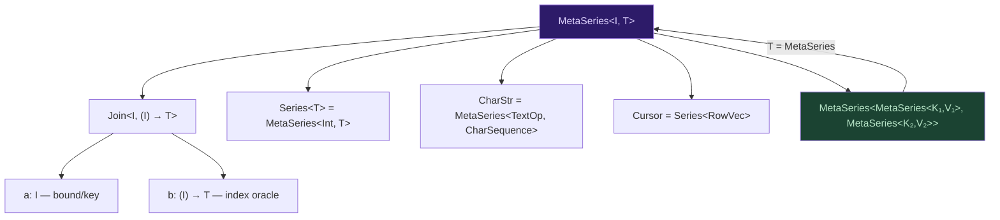
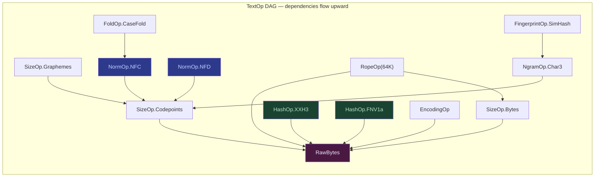
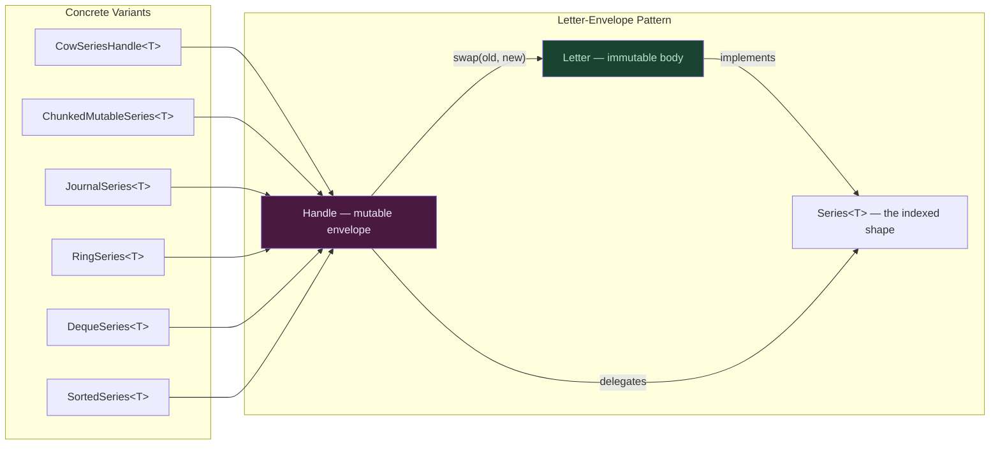
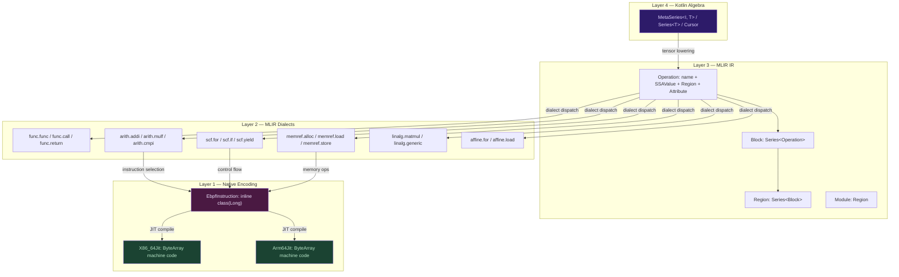

# Curiously Recursive MetaSeries Shapes

**Synthesis of CharStr-DAG × PRELOAD × TrikeShed Algebra Deep Dive**

---

## The Recursive Shape

Every structure in TrikeShed collapses to one shape:

```
MetaSeries<I, T> = Join<I, (I) -> T>
```

The "curiously recursive" part: `T` is itself a `MetaSeries`. The algebra is **closed under nesting** — a MetaSeries-of-MetaSeries is still a MetaSeries. This is the categorical claim that makes everything below possible.



The three shape families below are **specific instantiations** of this nesting at different abstraction layers.

---

## Shape Family 1: CharStr⁺-Combinators

> *A string is a point in TextOp-space, and TextOp-space is itself a Join algebra.*

### The Core Type

```kotlin
// CharStr is a 1-row, infinitely-wide row keyed by computed properties
typealias CharStr = MetaSeries<TextOp<*>, Any?>
//                = Join<TextOp<*>, (TextOp<*>) -> Any?>

// which reads as:
//   .a  = the TextOp key-space (bound/discriminant)
//   .b  = the answer oracle: (TextOp<R>) -> R
```

CharStr inverts the ordinary string. Instead of `[i: Int] -> Char`, it exposes `[op: TextOp] -> CharSequence`. The linear char view is just one `TextOp` among many.

### The TextOp DAG

TextOps form a **dependency DAG** — and that DAG is itself a Join:

```kotlin
// TextOp dependencies are a MetaSeries too
typealias TextOpDag = MetaSeries<TextOp<*>, Set<TextOp<*>>>
//                  = Join<TextOp<*>, (TextOp<*>) -> Set<TextOp<*>>>
```



### Combinator Composition: MetaSeries-of-MetaSeries

The genuine novelty: TextOp families compose under product. `(SizeOp × HashOp × RopeOp)` is a TextOp, and CharStr automatically participates in cross-products.

```kotlin
// A corpus is a matrix: row = CharStr, column = TextOp
typealias Corpus = MetaSeries<CharStr, MetaSeries<TextOp<*>, Any?>>

// Adding an index = adding a column = adding a TextOp. No code change.
// MetaSeries<HashOp, MetaSeries<NgramOp, IntSeries>>
//   = a precomputed inverted index for free-text search
```

The nesting prevents sealed-hierarchy explosion: new families don't widen the inner sealed class — they nest as a new outer Join layer.

### GADT-Flavored Dispatch

```kotlin
sealed class TextOp<R> {
    sealed class SizeOp : TextOp<Int>() {
        object Bytes : SizeOp()
        object Codepoints : SizeOp()
        object Graphemes : SizeOp()
        object UTF16Units : SizeOp()
    }
    sealed class HashOp : TextOp<Long>() {
        object XXH3 : HashOp()
        object FNV1a : HashOp()
        object SipHash13 : HashOp()
        object CRC32C : HashOp()
    }
    sealed class NormOp : TextOp<CharStr>() {
        object NFC : NormOp()
        object NFD : NormOp()
        object NFKC : NormOp()
        object NFKD : NormOp()
        object CaseFold : NormOp()
    }
    sealed class RopeOp : TextOp<RopeView>() { /*chunk, fanout*/ }
    sealed class NgramOp<R> : TextOp<R>()      { /*shingles, char, word*/ }
    sealed class FingerprintOp : TextOp<Long>() { /*SimHash, MinHash*/ }
}
```

### Memoization Strategy (from Deep Dive JIT analysis)

| Path | Strategy | Cost |
|------|----------|------|
| Hot ops (Size, Hash ≤3) | Explicit fields on `CharStrCached` | 1 load, scalarized by C2 |
| Warm ops (Norm, Rope) | `IdentityHashMap<TextOp, Any>` | 1 volatile read + 1 probe |
| Cold ops (Ngram, Fingerprint) | Lazy compute, no cache | Full recompute |

> [!IMPORTANT]
> The hot TextOp set must stay ≤3 for bimorphic JIT inlining. Beyond that, vtable dispatch costs ~1-2ns per call — fine for cold paths, kills tight loops.

---

## Shape Family 2: Associative⁺-Mutable Collections

> *Mutation is a swap of the immutable letter inside a mutable envelope — and the envelope itself is a MetaSeries.*

### The Mutation Algebra

Every mutable collection in TrikeShed follows the same recursive pattern: a **mutable handle** wrapping an **immutable body** that is itself a Series.



### Type Signatures — All MetaSeries

```kotlin
// Base: every mutable series IS a series
interface MutableSeries<T> : Series<T> { /* set, add, remove */ }

// CowSeriesHandle: flat Array body, O(n) arraycopy mutation
//   letter: COWSeriesBody<T> = Series<T> backed by Array<Any?>
//   version: Long — monotonic, no clock dependency
class CowSeriesHandle<T>(letter: COWSeriesBody<T>) : MutableSeries<T>

// ChunkedMutableSeries: fixed-size chunk tree, amortized O(1) append
//   stairs: IntArray — cumulative sizes (DAG of chunk boundaries)
//   chunks: Series<Series<T>> = MetaSeries<Int, MetaSeries<Int, T>>
//                              ← curiously recursive!

// JournalSeries: COW + undo journal
//   journal: RecursiveMutableSeries<Delta<T>>
//          = ChunkedMutable<Delta<T>>
//          = MetaSeries<Int, MetaSeries<Int, Delta<T>>>
//                              ← recursive again!

// RingSeries: power-of-2, mask indexing — O(1) everything
//   mask: capacity - 1  (one AND replaces one DIV)

// DequeSeries: front + back split
//   front + back = combine(frontSeries, backSeries)
//                = MetaSeries<Int, T> over a stitched view
```

### The Observer Chain as Join

Mutations fire observer callbacks — these are themselves Join-structured:

```kotlin
// CowSeriesHandle observer
observer: ((Twin<Series<T>>) -> Unit)?
//       = ((Join<Series<T>, Series<T>>) -> Unit)?
// Fires: old j new — the transition is a Twin, which is a Join<T,T>

versionObserver: ((Twin<Long>) -> Unit)?
// Fires: oldVersion j newVersion
```

### Complexity Staircase

| Variant | Read | Write | Append | Space | Recursive? |
|---------|------|-------|--------|-------|------------|
| `CowSeriesHandle` | O(1) | O(n) copy | O(n) copy | O(n) | No |
| `ChunkedMutable` | O(log chunks) | O(chunk) | O(1) amort | O(n) | **Yes** — Series\<Series\<T\>\> |
| `JournalSeries` | O(1) | O(1) + journal | O(1) | O(n + journal) | **Yes** — journal is ChunkedMutable |
| `RingSeries` | O(1) | O(1) | O(1) overwrite | O(capacity) | No |
| `DequeSeries` | O(1) 2-branch | O(1) view | O(1) view | O(n) | **Yes** — combine view |
| `SortedSeries` | O(1) | O(n) shift | O(log n + n) | O(n) | No |

> [!TIP]
> The curiously recursive variants (`ChunkedMutable`, `JournalSeries`, `DequeSeries`) all use **combine** — TrikeShed's query execution engine — to defer materialization until the `ReificationContext` budget (L1 cache topology) says the pointer-chasing cost exceeds the copy cost.

### Cache-Topology–Driven Materialization

```kotlin
// From the Deep Dive: ReificationContext controls when staircases flatten
fun from(topology: CacheTopology): ReificationContext {
    val l1 = topology.l1DataBytes ?: return ReificationContext(Int.MAX_VALUE)
    if (l1 < 4096) return ReificationContext(0)  // always materialize
    return ReificationContext(log2(l1.toDouble() / 4096.0).roundToInt().coerceIn(0, 16))
}
// depth = how many levels of lazy composition fit in L1
// before pointer-chasing exceeds copy cost
```

---

## Shape Family 3: MLIR⁺-EBPF Shapes

> *The algebra lowers through MLIR dialects into native instruction encodings — and each layer is still a MetaSeries.*

### The Lowering Stack



### MLIR as MetaSeries

The existing MLIR IR in TrikeShed maps directly to MetaSeries nesting:

```kotlin
// Block = Series<Operation>
//       = MetaSeries<Int, Operation>

// Region = Series<Block>
//        = MetaSeries<Int, MetaSeries<Int, Operation>>
//        ← curiously recursive!

// Module = Region containing func definitions
//        = MetaSeries<Int, MetaSeries<Int, MetaSeries<Int, Operation>>>

// MlirOp = Join<MlirDialect, CharSequence>  (dialect × op name)
//   with operandTypes/resultTypes as Series<CharSequence>
//   = Join<MlirDialect, CharSequence> + Series<CharSequence> × Series<CharSequence>
```

### EBPF as Dense-Packed Twin

The eBPF instruction is the **terminal shape** — the point where MetaSeries collapses to a single Long:

```kotlin
// EbpfInstruction = inline class(Long)
// This IS the wire format — no indirection, no object header
// Layout:  byte 0: opcode | byte 1: regs | bytes 2-3: offset | bytes 4-7: imm

// An EbpfProgram is a Series of instructions:
// EbpfProgram.instructions: LongArray
//   = Series<Long> via LongArray.toSeries()
//   = MetaSeries<Int, Long>

// The program IS a MetaSeries where the index function
// is a direct array lookup — O(1), no lambda, pure ALU
```

The eBPF encoding mirrors TrikeShed's dense-packed Twin pattern exactly:

| TrikeShed | eBPF |
|-----------|------|
| `TwInt(Long)` — pack 2×Int into 1 Long | `EbpfInstruction(Long)` — pack opcode+regs+offset+imm into 1 Long |
| `twin.a = raw ushr 32` | `inst.imm() = raw ushr 32` |
| `twin.b = raw.toInt()` | `inst.opcode() = raw and 0xFF` |
| 0 allocation, 1 shift + 1 mask per access | 0 allocation, shift + mask per field |

### The Lowering Correspondence

Each algebra operation maps to an MLIR dialect, which maps to eBPF instructions:

```kotlin
// Series α (projection) →
//   MLIR: scf.for + arith ops + memref.load/store
//   eBPF: loop unroll → ALU64 + LD/ST sequences

// Cursor RowVec access →
//   MLIR: memref.load at computed offset
//   eBPF: LDX with base+offset addressing

// combine (concatenation) →
//   MLIR: memref.subview + memref.copy (if materialized)
//         OR scf.if + memref.load (if lazy staircase)
//   eBPF: conditional jump + load (the stitch)

// Dense Twin unpack →
//   MLIR: arith.shrsi + arith.andi (shift + mask)
//   eBPF: ALU64 RSH + ALU64 AND (identical!)

// COW swap →
//   MLIR: memref.alloc + memref.copy + memref.dealloc
//   eBPF: not directly expressible — requires helper call
```

### EBPF Verifier as TextOp-DAG Analog

The eBPF verifier is structurally isomorphic to the TextOp dependency DAG:

```kotlin
// TextOp DAG: TextOp → Set<TextOp>  (what must be computed first)
// eBPF CFG:   PC → Set<PC>          (what branches reach here)

// Both are:
typealias DagShape<K> = MetaSeries<K, Set<K>>

// TextOp DAG validates: no cycles in dependency computation
// eBPF verifier validates: no cycles in control flow (DAG property)
//                          + register liveness (dataflow on the DAG)
//                          + bounded execution (depth budget)

// The ReificationContext.maxDepth ↔ eBPF verifier's instruction limit
// Both enforce: "the lazy composition depth is bounded"
```

---

## The Unifying Table

| Concept | CharStr⁺ Shape | Collection⁺ Shape | MLIR⁺-EBPF Shape |
|---------|----------------|-------------------|-------------------|
| **Base type** | `MetaSeries<TextOp<*>, Any?>` | `MetaSeries<Int, T>` | `MetaSeries<Int, Operation>` |
| **Recursive nesting** | `MetaSeries<HashOp, MetaSeries<NgramOp, Int>>` | `Series<Series<T>>` (ChunkedMutable) | `Region = Series<Block> = Series<Series<Op>>` |
| **DAG structure** | TextOp dependency graph | Staircase combine graph | eBPF CFG / MLIR region tree |
| **Memoization** | Hot fields + cold map | COW letter snapshot | SSA value numbering |
| **Equality** | Canonical TextOp (NFC + XXH3) | Version counter (monotonic Long) | SSA identity |
| **Mutation** | Immutable — new cell per compute | Letter-envelope swap | SSA — new value per op |
| **Dispatch** | Sealed hierarchy (≤3 hot, bimorphic) | Monomorphic lambda (one class) | OpClass enum (7 dispatch groups) |
| **Dense packing** | — | TwInt: 2×Int in 1 Long | EbpfInstruction: 4 fields in 1 Long |
| **Materialization** | Lazy by default, eager for canonical ops | ReificationContext (L1 budget) | JIT compile (eBPF → x86/ARM) |
| **Boundary** | CharSequence → CharStr at kernel edge | Array → Series at builder edge | MLIR text → IR at parse edge |

---

## The Recursive Insight

The "curiously recursive" pattern is not an accident — it is the **sole compositional primitive**:

1. **CharStr** — a MetaSeries whose *values* are MetaSeries (NgramOp over HashOp over raw bytes)
2. **ChunkedMutable** — a MetaSeries whose *elements* are MetaSeries (chunks of T)
3. **JournalSeries** — a MetaSeries whose *journal entries* are in a ChunkedMutable (MetaSeries of MetaSeries of Delta)
4. **MLIR Region** — a MetaSeries whose *blocks* contain MetaSeries of *operations*
5. **Cursor** — a MetaSeries whose *rows* are MetaSeries of *(value, metadata)* pairs
6. **Corpus** — a MetaSeries of CharStr, each of which is a MetaSeries of TextOp answers

> [!NOTE]
> The CRTP (Curiously Recurring Template Pattern) in C++ makes a class parameterized by itself. TrikeShed's pattern is different — it makes a *type alias* whose parameter *is the same type alias*. `MetaSeries<MetaSeries<K,V>, MetaSeries<K',V'>>` is the type-level fixed point. The algebra closes over itself.

### Why This Matters

- **New TextOp family** → new outer MetaSeries layer → no inner sealed class widening → ABI-safe
- **New collection variant** → new letter type inside the same envelope → same observer chain → composition-safe  
- **New MLIR dialect** → new enum case in `MlirDialect` → same `Operation` structure → IR-safe
- **New eBPF instruction class** → new case in `OpClass` → same `Long` encoding → encoding-safe

The recursive nesting is what makes all four additions **non-breaking**. Each layer absorbs novelty by wrapping, not by widening.

---

## Open Questions

> [!IMPORTANT]
> **Canonical equality for CharStr**: The DAG dissertation says "pick NormOp.NFC + HashOp.XXH3 and document it." Is this the right default, or should the canonical be configurable per-Corpus?

> [!WARNING]
> **MLIR lowering completeness**: The current `MlirCore.kt` defines ops but doesn't have a lowering path from Cursor α-chains to MLIR IR. Should this synthesis drive implementation of `CursorToMlir` lowering, or remain a design document?

> [!IMPORTANT]
> **eBPF as CharStr target**: Could a `TextOp.EbpfHash` exist that JIT-compiles a hash function via the eBPF engine, runs it in-kernel for packet classification, and memoizes the result in the CharStr cell? This would close the loop between Shape Family 1 and Shape Family 3.
