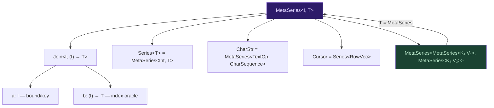
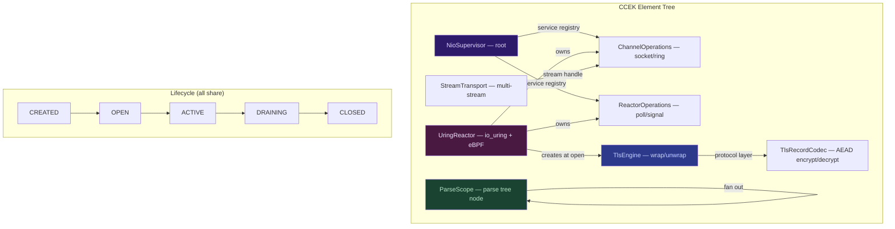
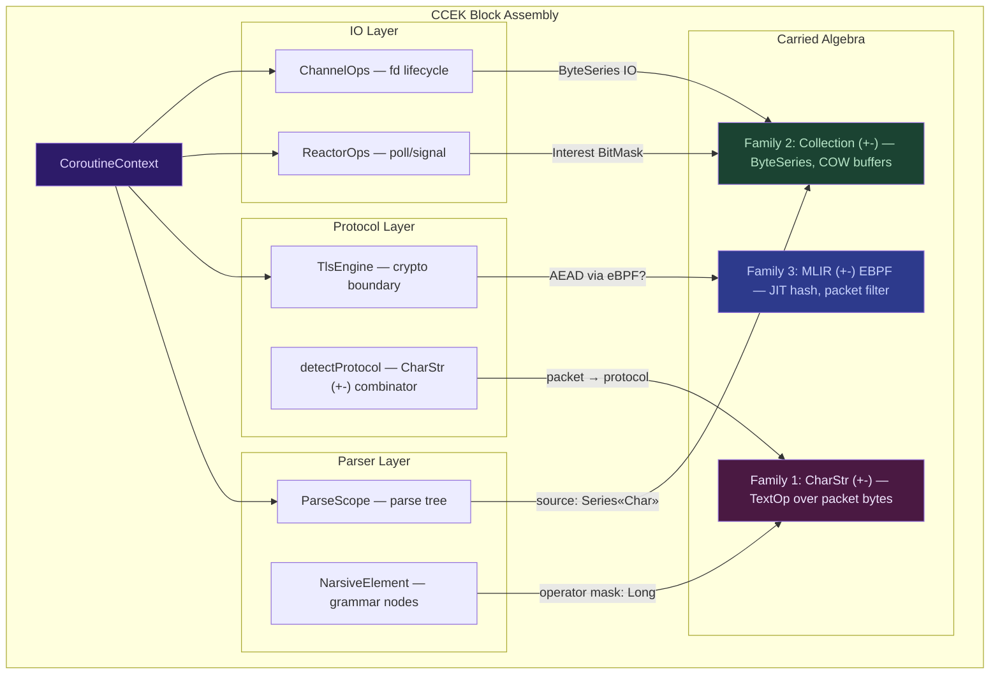
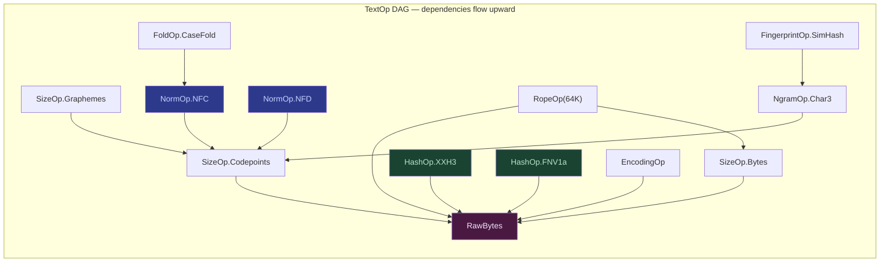
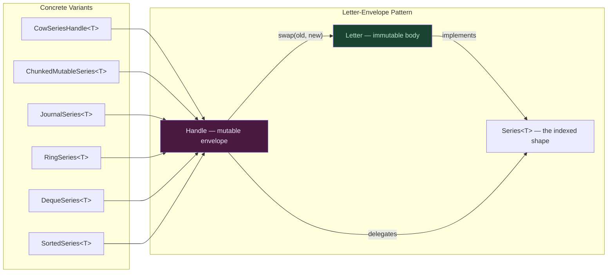
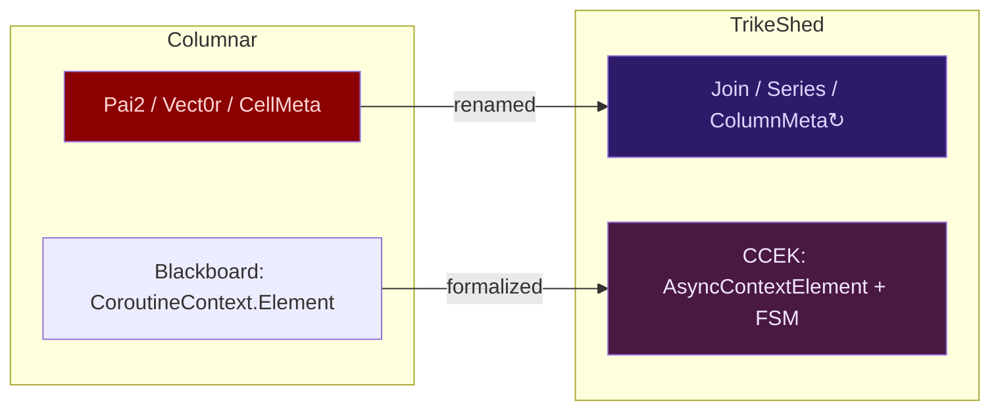
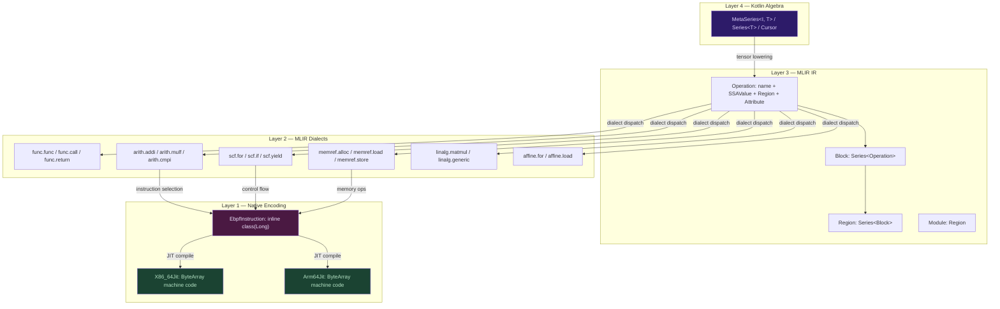

# Curiously Recursive MetaSeries Shapes

**Synthesis of CharStr-DAG × PRELOAD × TrikeShed Algebra Deep Dive**

---

## The Recursive Shape

Every structure in TrikeShed collapses to one shape:

```
MetaSeries<I, T> = Join<I, (I) -> T>
```

The "curiously recursive" part: `T` is itself a `MetaSeries`. The algebra is **closed under nesting** — a MetaSeries-of-MetaSeries is still a MetaSeries. This is the categorical claim that makes everything below possible.

The Kotlin language is the enabling vehicle: **typealiases**, **scoped extension functions**, and **inline classes** together provide a pointer-free vtable minimum for zero-cost abstractions. A typealias like `Cursor = Series<RowVec>` introduces no runtime dispatch — the JIT sees through to `Join<Int, (Int) -> Join<...>>` — but the typealias *is* the new extension vtable for all cursor-scoped utilities. This is the mechanism that lets the algebra wallpaper reality with idempotent projections while dealing with storage and garbage collection lifecycles realistically, without adding non-determinism into the purity bubble.



The four shape families below are **specific instantiations** of this nesting at different abstraction layers. Shape Family 0 is the macroscopic envelope — it subsumes the other three as context-carried algebra inside **CCEK** (**C**oroutine → **C**ontext → **E**lement → **K**ey) block assemblies.

---

## Shape Family 0: IO (+-) Reactor (+-) Protocol (+-) Parser Shapes (CCEK)

> *The scope tree IS the parse tree. The reactor tree IS the IO tree. Both are MetaSeries-of-MetaSeries with forward-only lifecycle and structured fanout — and they subsume Families 1–3 as context-carried algebra.*

### The CCEK Downward Creation Flow

CCEK stands for **Coroutine → Context → Element → Key**. It is the macroscopic shape:

```
Coroutine creates Context which holds Element which is routed by Key
```

Each level is a Join:

```kotlin
// The fundamental CCEK shape
// Key:     singleton identity object (===), parameterized by Element type
// Element: AsyncContextElement with lifecycle FSM + supervisor job + fanout
// Context: CoroutineContext = fold of Elements via Key routing
// Coroutine: coroutineScope { launch(context) { ... } }

// Key IS a MetaSeries discriminant:
//   AsyncContextKey<E> : CoroutineContext.Key<E>
//   ctx[Key] → E?    (typed lookup — the index function!)

// So CoroutineContext IS a MetaSeries:
typealias ContextShape<K, E> = MetaSeries<K, E?>
//   where K = CoroutineContext.Key<E>
//   and   E = CoroutineContext.Element
//   .a = Key (the discriminant)
//   .b = ctx[key] (the lookup oracle — returns E? by identity)
```

### The Lifecycle FSM as BitMasked Ordinal

Every CCEK element traverses the same forward-only lifecycle — encoded as `BitMasked<UInt>`:

```kotlin
enum class ElementState : BitMasked<UInt> {
    CREATED,   // constructed, not yet wired
    OPEN,      // subscribed, ready to activate
    ACTIVE,    // processing
    DRAINING,  // no new work, completing in-flight
    CLOSED;    // sealed, immutable

    override val mask: UInt get() = 1u shl ordinal
}
// Forward-only: CREATED → OPEN → ACTIVE → DRAINING → CLOSED
// BitMasked enables O(1) state comparison via isAtLeast/isLessThan
```

This lifecycle is shared across **all** CCEK layers — NIO, Reactor, TLS, Parser, eBPF:



### The Four CCEK Assemblies

Each assembly is a **MetaSeries of Elements** routed by Key — and each element internally carries a lower CRMS family:

#### Assembly 1: IO (Channels + Rings)

```kotlin
// ChannelOperations : CoroutineContext.Element
//   companion object Key : CoroutineContext.Key<ChannelOperations>
//   openChannel(entries) → ChannelHandle
//   ChannelHandle: read/write/readv/writev/prepAccept/submit/wait

// ChannelHandle.wait() returns List<ChannelResult>
//   = Series<Join<fd, res, userData>>
//   ← the completion queue IS a Series

// SelectableChannelOps speaks ByteSeries/ByteRegion, not ByteArray
//   tryRead(dst: ByteRegion): Int    ← Shape Family 2 (Collections)
//   tryWrite(src: ByteSeries): Int   ← Shape Family 2 (Collections)
```

#### Assembly 2: Reactor (Poll + Signal)

```kotlin
// ReactorOperations : CoroutineContext.Element
//   register(fd, interests: Set<Interest>, userData)
//   deregister(fd)
//   poll(timeout) → List<ReactorSignal>

// Interest : BitMasked<UInt> { READ, WRITE, ACCEPT, CONNECT, ERROR }
//   Interest.fromMask(mask) → Set<Interest>
//   Interest.toMask(set) → UInt
//   ← BitMasked is the same algebra as ElementState — ordinal shift+mask

// ReactorSignal = Join<fd, Set<Interest>, userData>
//   ← the signal IS a Join triple

// ChannelRunner: the event loop
//   readers: Map<fd, CompletableDeferred<Int>>    ← coroutine suspension
//   writers: Map<fd, CompletableDeferred<Unit>>   ← coroutine suspension
//   run(scope) { while(active) { poll → dispatch } }
//   ← the reactor loop IS the materialization point for IO completion Series
```

#### Assembly 3: Protocol (TLS + Transport + Detection)

```kotlin
// TlsEngine : CoroutineContext.Element
//   wrap(plain: ByteArray): ByteArray      ← encrypt
//   unwrap(encrypted: ByteArray): ByteArray ← decrypt
//   handshake(reader, writer)              ← key exchange

// TlsRecordCodec : CoroutineContext.Element
//   encrypt(direction, innerType, plaintext) → wire bytes
//   decrypt(direction, wire) → plaintext?
//   installKeys(clientKey, clientIv, serverKey, serverIv)

// StreamTransport : CoroutineContext.Element
//   openStream() → StreamHandle(id, send: SendChannel, recv: ReceiveChannel)
//   activeStreams: Int

// UringReactor.detectProtocol(firstPacket: ByteArray) → ProtocolType
//   ProtocolType { BitTorrent, IPFS, HTTP, WebSocket, Unknown }
//   ← protocol detection is a CharStr-like operation:
//      the first packet IS a Series<Byte>, and detectProtocol is a TextOp
//      that returns a discriminant from the sealed ProtocolType family

// The protocol layer subsumes Shape Family 1 (CharStr):
//   packet bytes → protocol detection TextOp → protocol-specific parser
//   ← the protocol parser IS a CharStr combinator applied to ByteSeries
```

#### Assembly 4: Parser (Concurrent Parse Scopes)

```kotlin
// ParseScope : CoroutineContext.Element
//   source: Series<Char>           ← Shape Family 2 (indexed data)
//   span: Twin<Int>                ← Shape Family 2 (dense pair)
//   children: MutableList<ParseScope>  ← recursive!
//   results: MutableList<Any?>
//   supervisor: SupervisorJob

// The scope tree IS the parse tree:
//   ParseScope.childScope(childSpan) → ParseScope
//   ParseScope.fanout(identify, childParser) → Series<Any?>
//   ← fanout creates child scopes under SupervisorJob
//   ← one child failure doesn't cancel siblings (supervisor isolation)

// ParseScope.fanoutParsers(identify, childParserFactory) → Series<T>
//   identify: (Series<Char>, Twin<Int>) → Series<Join<Twin<Int>, Int>>
//   ← produces (span, tag) pairs — a MetaSeries of Joins!
//   childParserFactory: (tag: Int) → parser
//   ← the factory IS a MetaSeries<Int, Parser> — index by tag

// Narsive grammar elements participate in CCEK directly:
//   NarsiveElementKind : CoroutineContext.Key<NarsiveElement>
//   NarsiveElement : CoroutineContext.Element
//   NarsiveSupervisorJob.fanout(key) → Series<NarsiveElement>
//   ← fanout by Key IS ctx[key] generalized to Series
```

### Subsumption: How CCEK Wraps the Lower Three

The CCEK layer doesn't replace Families 1–3 — it **carries** them as context-scoped algebra:



### The CCEK MetaSeries Nesting

```kotlin
// NioSupervisor.services: MutableList<CoroutineContext.Element>
//   = a mutable Series of Elements
//   = CowSeriesHandle<Element> conceptually (Family 2!)
//   resolved via: inline fun <reified T> service(): T?

// ParseScope.children: MutableList<ParseScope>
//   = Series<ParseScope>
//   = MetaSeries<Int, ParseScope>
//   where ParseScope itself contains Series<Char> (source) + Twin<Int> (span)
//   = MetaSeries<Int, MetaSeries<Int, Char>>  ← curiously recursive!

// NarsiveSupervisorJob.fanoutCache
//   = SeriesBuffer<Pair<Key, Series<NarsiveElement>>>
//   = Series<Join<Key, Series<Element>>>
//   = MetaSeries<Int, Join<Key, MetaSeries<Int, Element>>>
//   ← recursive: Series of (Key × Series) pairs

// UringReactor child elements:
//   ChannelOperations + ReactorOperations + TlsSettings
//   = a fixed product of Elements, opened/closed in lifecycle order
//   = Join<ChannelOps, Join<ReactorOps, TlsSettings>>
//   ← a nested Join triple — MetaSeries at the type level
```

### The Algebra Subsumption Pattern

The key insight: **CCEK is the algebra that binds Families 1–3 to execution scope**.

| Lower Family | What it provides | How CCEK carries it |
|-------------|-----------------|-------------------|
| **Family 1: CharStr (+-)** | TextOp algebra over text | Protocol detection applies TextOp to packet `ByteSeries`. Narsive operators are `BitMaskedLong` combinators routed through `CoroutineContext.Key`. |
| **Family 2: Collection (+-)** | COW / Chunked / Ring buffers | `ChannelOps` speaks `ByteSeries`. `ParseScope.source` is `Series<Char>`. `ReactorSignal` is a Join. `Interest` is `BitMasked<UInt>`. |
| **Family 3: MLIR (+-) EBPF** | IR lowering + native encoding | `UringReactor` attaches eBPF to `io_uring` SQEs. Verifier DAG validates packet filters. JIT code executes within the reactor's lifecycle FSM. |

The subsumption is not metaphorical — it is **structural**:

```kotlin
// Without CCEK:
//   val hash = charStr[HashOp.XXH3]           // Family 1: compute hash
//   val buf = CowSeriesHandle(data)           // Family 2: buffer data
//   val code = X86_64Jit.compile(bpfProg)     // Family 3: JIT compile

// With CCEK — the same operations, scoped to lifecycle:
coroutineScope {
    val nio = NioSupervisor().also { it.open() }     // CREATED → ACTIVE
    val reactor = UringReactor(channelOps, reactorOps)
    reactor.open()                                    // opens children too

    // Family 3 carried by reactor:
    reactor.attachBpfFilter(listenFd)                 // eBPF inside CCEK

    // Family 2 carried by channel:
    val handle = channelOps.openChannel()             // ring buffer
    handle.readv(fd, buffer)                          // ByteSeries IO

    // Family 1 carried by protocol detection:
    val proto = reactor.detectProtocol(firstPacket)   // CharStr (+-) combinator

    // Family 1+2 carried by parser:
    withParseScope(source) { src, span ->             // ParseScope element
        fanout(identify, childParser)                 // concurrent sub-parsers
    }

    reactor.close()                                   // DRAINING → CLOSED
    nio.close()                                       // children cascade
}
// SupervisorJob cancellation propagates through the element tree
// Lifecycle FSM ensures: no eBPF after close, no IO after drain
```

> [!TIP]
> The CCEK lifecycle FSM (`CREATED→OPEN→ACTIVE→DRAINING→CLOSED`) is the **materialization policy** for effectful computation, analogous to `ReificationContext.maxDepth` for lazy data composition. Both answer the same question: "when does the deferred composition become concrete?" For data, the answer is cache topology. For effects, the answer is lifecycle state.

---

## Shape Family 1: CharStr (+-) Combinators

> *A string is a point in TextOp-space, and TextOp-space is itself a Join algebra.*

### The Core Type

```kotlin
// CharStr is a 1-row, infinitely-wide row keyed by computed properties
typealias CharStr = MetaSeries<TextOp<*>, Any?>
//                = Join<TextOp<*>, (TextOp<*>) -> Any?>

// which reads as:
//   .a  = the TextOp key-space (bound/discriminant)
//   .b  = the answer oracle: (TextOp<R>) -> R
```

CharStr inverts the ordinary string. Instead of `[i: Int] -> Char`, it exposes `[op: TextOp] -> CharSequence`. The linear char view is just one `TextOp` among many.

### The TextOp DAG

TextOps form a **dependency DAG** — and that DAG is itself a Join:

```kotlin
// TextOp dependencies are a MetaSeries too
typealias TextOpDag = MetaSeries<TextOp<*>, Set<TextOp<*>>>
//                  = Join<TextOp<*>, (TextOp<*>) -> Set<TextOp<*>>>
```



### Combinator Composition: MetaSeries-of-MetaSeries

The genuine novelty: TextOp families compose under product. `(SizeOp × HashOp × RopeOp)` is a TextOp, and CharStr automatically participates in cross-products.

```kotlin
// A corpus is a matrix: row = CharStr, column = TextOp
typealias Corpus = MetaSeries<CharStr, MetaSeries<TextOp<*>, Any?>>

// Adding an index = adding a column = adding a TextOp. No code change.
// MetaSeries<HashOp, MetaSeries<NgramOp, IntSeries>>
//   = a precomputed inverted index for free-text search
```

The nesting prevents sealed-hierarchy explosion: new families don't widen the inner sealed class — they nest as a new outer Join layer.

### GADT (Generalized Algebraic Data Type) Flavored Dispatch

```kotlin
sealed class TextOp<R> {
    sealed class SizeOp : TextOp<Int>() {
        object Bytes : SizeOp()
        object Codepoints : SizeOp()
        object Graphemes : SizeOp()
        object UTF16Units : SizeOp()
    }
    sealed class HashOp : TextOp<Long>() {
        object XXH3 : HashOp()
        object FNV1a : HashOp()
        object SipHash13 : HashOp()
        object CRC32C : HashOp()
    }
    sealed class NormOp : TextOp<CharStr>() {
        object NFC : NormOp()
        object NFD : NormOp()
        object NFKC : NormOp()
        object NFKD : NormOp()
        object CaseFold : NormOp()
    }
    sealed class RopeOp : TextOp<RopeView>() { /*chunk, fanout*/ }
    sealed class NgramOp<R> : TextOp<R>()      { /*shingles, char, word*/ }
    sealed class FingerprintOp : TextOp<Long>() { /*SimHash, MinHash*/ }
}
```

### Memoization Strategy (from Deep Dive JIT analysis)

| Path | Strategy | Cost |
|------|----------|------|
| Hot ops (Size, Hash ≤3) | Explicit fields on `CharStrCached` | 1 load, scalarized by C2 |
| Warm ops (Norm, Rope) | `IdentityHashMap<TextOp, Any>` | 1 volatile read + 1 probe |
| Cold ops (Ngram, Fingerprint) | Lazy compute, no cache | Full recompute |

> [!IMPORTANT]
> The hot TextOp set must stay ≤3 for bimorphic JIT inlining. Beyond that, vtable dispatch costs ~1-2ns per call — fine for cold paths, kills tight loops.

---

## Shape Family 2: Associative (+-) Mutable Collections

> *Mutation is a swap of the immutable letter inside a mutable envelope — and the envelope itself is a MetaSeries.*

### The Mutation Algebra

Every mutable collection in TrikeShed follows the same recursive pattern: a **mutable handle** wrapping an **immutable body** that is itself a Series.



### Type Signatures — All MetaSeries

```kotlin
// Base: every mutable series IS a series
interface MutableSeries<T> : Series<T> { /* set, add, remove */ }

// CowSeriesHandle: flat Array body, O(n) arraycopy mutation
//   letter: COWSeriesBody<T> = Series<T> backed by Array<Any?>
//   version: Long — monotonic, no clock dependency
class CowSeriesHandle<T>(letter: COWSeriesBody<T>) : MutableSeries<T>

// ChunkedMutableSeries: fixed-size chunk tree, amortized O(1) append
//   stairs: IntArray — cumulative sizes (DAG of chunk boundaries)
//   chunks: Series<Series<T>> = MetaSeries<Int, MetaSeries<Int, T>>
//                              ← curiously recursive!

// JournalSeries: COW + undo journal
//   journal: RecursiveMutableSeries<Delta<T>>
//          = ChunkedMutable<Delta<T>>
//          = MetaSeries<Int, MetaSeries<Int, Delta<T>>>
//                              ← recursive again!

// RingSeries: power-of-2, mask indexing — O(1) everything
//   mask: capacity - 1  (one AND replaces one DIV)

// DequeSeries: front + back split
//   front + back = combine(frontSeries, backSeries)
//                = MetaSeries<Int, T> over a stitched view
```

### The Observer Chain as Join

Mutations fire observer callbacks — these are themselves Join-structured:

```kotlin
// CowSeriesHandle observer
observer: ((Twin<Series<T>>) -> Unit)?
//       = ((Join<Series<T>, Series<T>>) -> Unit)?
// Fires: old j new — the transition is a Twin, which is a Join<T,T>

versionObserver: ((Twin<Long>) -> Unit)?
// Fires: oldVersion j newVersion
```

### Complexity Staircase

| Variant | Read | Write | Append | Space | Recursive? |
|---------|------|-------|--------|-------|------------|
| `CowSeriesHandle` | O(1) | O(n) copy | O(n) copy | O(n) | No |
| `ChunkedMutable` | O(log chunks) | O(chunk) | O(1) amort | O(n) | **Yes** — Series\<Series\<T\>\> |
| `JournalSeries` | O(1) | O(1) + journal | O(1) | O(n + journal) | **Yes** — journal is ChunkedMutable |
| `RingSeries` | O(1) | O(1) | O(1) overwrite | O(capacity) | No |
| `DequeSeries` | O(1) 2-branch | O(1) view | O(1) view | O(n) | **Yes** — combine view |
| `SortedSeries` | O(1) | O(n) shift | O(log n + n) | O(n) | No |

> [!TIP]
> The curiously recursive variants (`ChunkedMutable`, `JournalSeries`, `DequeSeries`) all use **combine** — TrikeShed's query execution engine — to defer materialization until the `ReificationContext` budget (L1 cache topology) says the pointer-chasing cost exceeds the copy cost.

### Cache-Topology–Driven Materialization

```kotlin
// From the Deep Dive: ReificationContext controls when staircases flatten
fun from(topology: CacheTopology): ReificationContext {
    val l1 = topology.l1DataBytes ?: return ReificationContext(Int.MAX_VALUE)
    if (l1 < 4096) return ReificationContext(0)  // always materialize
    return ReificationContext(log2(l1.toDouble() / 4096.0).roundToInt().coerceIn(0, 16))
}
// depth = how many levels of lazy composition fit in L1
// before pointer-chasing exceeds copy cost
```

---

## The Cursor Assembly: From Columnar `Pai2`/`Vect0r` to TrikeShed `Join`/`Series`

> *Source: [github.com/jnorthrup/columnar](https://github.com/jnorthrup/columnar/blob/2f144c52e50aa0958bec0f7ee37cf2d72a015339/README.md) — TrikeShed is the "second draft from scratch keeping what works well, making a deliberate departure from the JDK as kotlin-MPP."*

The Columnar types and their TrikeShed renames — the structure is identical:

```kotlin
// ── Columnar (JVM) ──────────────────── ── TrikeShed (KMP) ──────
interface Pai2<A, B> { val a: A; val b: B }  // → Join<A, B>
typealias Vect0r<T> = Pai2<Int, (Int) -> T>  // → Series<T>
typealias Vect02<F, S> = Vect0r<Pai2<F, S>>  // → Series2<A, B>
typealias RecordMeta = Pai2<String, TypeMemento>  // → ColumnMeta = Join<CharSequence, TypeMemento>
typealias CellMeta = () -> CoroutineContext   // → `ColumnMeta↻` = () -> ColumnMeta  (narrowed)
typealias RowVec = Vect02<Any?, CellMeta>     // → Series2<Any?, `ColumnMeta↻`>
typealias Cursor = Vect0r<RowVec>             // → Series<RowVec>
```

**The Cursor was never a class hierarchy.** Even in Columnar, it was a typealias chain. The sealed class hierarchies lived in the Blackboard — `CoroutineContext.Element` subclasses that Columnar's README describes as *"orthogonal context elements... easy to think of as hierarchical threadlocals to achieve IOBound storage access."* TrikeShed's CCEK formalized this into a lifecycle FSM.

The only structural change: `CellMeta = () -> CoroutineContext` (returning the entire context) was narrowed to `ColumnMeta↻ = () -> ColumnMeta` (returning just the name+type pair). The Blackboard's `CoroutineContext.Element` sealed hierarchies were extracted into the CCEK layer above the Cursor, where they belong.



### The Columnar Optimization: ReifiedSplitSeries2

The hot-path optimization recovers column-major access inside the row-major RowVec abstraction:

```kotlin
// The naive RowVec is row-major: accessing cell i constructs a Join per call
//   RowVec.b(i) → Join(values[i], metas[i])  ← one Join allocation per access

// ReifiedSplitSeries2 stores left/right Series separately:
class ReifiedSplitSeries2<A, B>(
    val leftSeries: Series<A>,    // ← all values, contiguous
    val rightSeries: Series<B>,   // ← all metas, contiguous
) : Series2<A, B>

// Hot-path bypass:
val RowVec.values: Series<Any?>
    get() = (this as? ReifiedSplitSeries2<*, *>)?.leftSeries as? Series<Any?>
        ?: this.α { it.a }  // ← fallback: construct values via α-conversion

// This recovers the column-major access pattern inside the RowVec algebra
// without breaking the typealias chain.
// Zero Join allocation when the concrete type is ReifiedSplitSeries2.
```

### The Projection Densification Ladder

`Densification.kt` explicitly documents the evolution as a compression ratio:

```kotlin
// Each layer specializes Join<A,B> at increasing density:
Projection.lib()    // "Join<A,B>"                           density = 1.0x
Projection.cursor() // "Join<Any?, ()->ColumnMeta>"          density = 4.0x
Projection.ccek()   // "Join<Key<*>, Element>"               density = 8.0x
Projection.wam()    // "Join<Map<String,String>, Boolean>"   density = 16.0x

// density measures: how much pointer-chasing was eliminated
// relative to the raw Join baseline.
// cursor @ 4x: eliminated String[] + Object[] + vtable dispatch
// ccek   @ 8x: eliminated the Columnar interface itself — Key is identity (===)
// wam    @ 16x: eliminated generic dispatch entirely — inline class packing
```

### Cursor as Cross-Family Assembly Point

The Cursor is where all four CRMS families meet:

| Family | How Cursor Uses It |
|--------|-------------------|
| **Family 0 (CCEK)** | `ParseScope.source` is `Series<Char>` — a 1-column Cursor. `ParseScope.fanoutParsers` produces `Series<Join<Twin<Int>, Int>>` — a RowVec of (span, tag) pairs. |
| **Family 1 (CharStr (+-))** | `Cursor.meta` accesses column names as `Series<CharSequence>` — each name is a CharStr candidate. `IOMemento` enum dispatch is the TypeMemento sealed hierarchy. |
| **Family 2 (Collection (+-))** | `SimpleCursor` delegates `by c: Join<Int, (Int) -> RowVec>` — the cursor IS a Series, using COW for mutation. `CursorTensorReifier.fromCursor()` materializes into `DoubleArray` via the ReificationContext pattern. |
| **Family 3 (MLIR (+-) eBPF)** | `CursorTensorSnapshot.values: DoubleArray` is the terminal dense-packed form — analogous to `EbpfInstruction(Long)`. `WasmDoubleTensor` targets Wasm SIMD, paralleling the eBPF JIT target. |

### ManifoldConcept: Cursor-as-NARS3-Concept

The most striking proof that Cursor is the universal assembly point: `ManifoldConcept<P>` **implements RowVec**:

```kotlin
class ManifoldConcept<out P>(
    val angular: Long,       // identity coordinate (hamming distance)
    val budget: BudgetCoord, // inline class(Long) — p×d×q packed in 60 bits
    val payload: P,
) : RowVec {
    // IS a RowVec — angular j budget as a 2-column row
    override val a: Int get() = 2
    override val b: (Int) -> Join<Any?, `ColumnMeta↻`> get() = { i ->
        when (i) {
            0 -> angular j { ColumnMeta("angular", IoLong) }
            else -> budget.packed j { ColumnMeta("budget", IoLong) }
        }
    }
}
// A NARS3 concept IS a Cursor row.
// BudgetCoord(Long) IS a dense-packed Twin (3×20-bit fields in 60 bits).
// hamming(a.angular, b.angular) IS the Cursor-level distance metric.
// NarsBag.budgetTensor() IS CursorTensorSnapshot for NARS concepts.
```

> [!NOTE]
> The `ManifoldConcept : RowVec` implementation closes the loop: a cognitive concept is a database row is a MetaSeries cell. TrikeShed's typealias chain makes the relationship structural, not nominal — with all of the same pitfalls that productive immutable designs create: overwhelming mutability accounting requirements and budget tradeoffs that rarely have a heuristic simpler than a Graal JIT.

> [!NOTE]
> The Manifold and Tensor shapes emerged alongside each other out of contemporary scientific all-things-endpoint review, which needed to be conducted to arrive at the type-erasure / type-hoisting of isomorphic type-safe permutation consolidation and normalization with mechanical sympathy. The Cursor, Manifold, and Series are still in their first iteration — the CRMS pattern identifies the monomorphic vehicle of sane composition, but the shapes themselves need further maturation.

---

## Shape Family 3: MLIR (+-) EBPF Shapes

> *The algebra lowers through MLIR dialects into native instruction encodings — and each layer is still a MetaSeries.*

### The Lowering Stack



### MLIR as MetaSeries

The existing MLIR IR in TrikeShed maps directly to MetaSeries nesting:

```kotlin
// Block = Series<Operation>
//       = MetaSeries<Int, Operation>

// Region = Series<Block>
//        = MetaSeries<Int, MetaSeries<Int, Operation>>
//        ← curiously recursive!

// Module = Region containing func definitions
//        = MetaSeries<Int, MetaSeries<Int, MetaSeries<Int, Operation>>>

// MlirOp = Join<MlirDialect, CharSequence>  (dialect × op name)
//   with operandTypes/resultTypes as Series<CharSequence>
//   = Join<MlirDialect, CharSequence> + Series<CharSequence> × Series<CharSequence>
```

### EBPF as Dense-Packed Twin

The eBPF instruction is the **terminal shape** — the point where MetaSeries collapses to a single Long:

```kotlin
// EbpfInstruction = inline class(Long)
// This IS the wire format — no indirection, no object header
// Layout:  byte 0: opcode | byte 1: regs | bytes 2-3: offset | bytes 4-7: imm

// An EbpfProgram is a Series of instructions:
// EbpfProgram.instructions: LongArray
//   = Series<Long> via LongArray.toSeries()
//   = MetaSeries<Int, Long>

// The program IS a MetaSeries where the index function
// is a direct array lookup — O(1), no lambda, pure ALU
```

The eBPF encoding mirrors TrikeShed's dense-packed Twin pattern exactly:

| TrikeShed | eBPF |
|-----------|------|
| `TwInt(Long)` — pack 2×Int into 1 Long | `EbpfInstruction(Long)` — pack opcode+regs+offset+imm into 1 Long |
| `twin.a = raw ushr 32` | `inst.imm() = raw ushr 32` |
| `twin.b = raw.toInt()` | `inst.opcode() = raw and 0xFF` |
| 0 allocation, 1 shift + 1 mask per access | 0 allocation, shift + mask per field |

### The Lowering Correspondence

Each algebra operation maps to an MLIR dialect, which maps to eBPF instructions:

```kotlin
// Series α (projection) →
//   MLIR: scf.for + arith ops + memref.load/store
//   eBPF: loop unroll → ALU64 + LD/ST sequences

// Cursor RowVec access →
//   MLIR: memref.load at computed offset
//   eBPF: LDX with base+offset addressing

// combine (concatenation) →
//   MLIR: memref.subview + memref.copy (if materialized)
//         OR scf.if + memref.load (if lazy staircase)
//   eBPF: conditional jump + load (the stitch)

// Dense Twin unpack →
//   MLIR: arith.shrsi + arith.andi (shift + mask)
//   eBPF: ALU64 RSH + ALU64 AND (identical!)

// COW swap →
//   MLIR: memref.alloc + memref.copy + memref.dealloc
//   eBPF: not directly expressible — requires helper call
```

### EBPF Verifier as TextOp-DAG Analog

The eBPF verifier is structurally isomorphic to the TextOp dependency DAG:

```kotlin
// TextOp DAG: TextOp → Set<TextOp>  (what must be computed first)
// eBPF CFG:   PC → Set<PC>          (what branches reach here)

// Both are:
typealias DagShape<K> = MetaSeries<K, Set<K>>

// TextOp DAG validates: no cycles in dependency computation
// eBPF verifier validates: no cycles in control flow (DAG property)
//                          + register liveness (dataflow on the DAG)
//                          + bounded execution (depth budget)

// The ReificationContext.maxDepth ↔ eBPF verifier's instruction limit
// Both enforce: "the lazy composition depth is bounded"
```

---

## The Unifying Table

| Concept | CCEK Shape (Family 0) | CharStr (+-) Shape | Collection (+-) Shape | MLIR (+-) EBPF Shape |
|---------|----------------------|----------------|-------------------|-------------------|
| **Base type** | `MetaSeries<Key, Element?>` | `MetaSeries<TextOp<*>, Any?>` | `MetaSeries<Int, T>` | `MetaSeries<Int, Operation>` |
| **Recursive nesting** | `ParseScope(Series<Char>, children: Series<ParseScope>)` | `MetaSeries<HashOp, MetaSeries<NgramOp, Int>>` | `Series<Series<T>>` (ChunkedMutable) | `Region = Series<Block> = Series<Series<Op>>` |
| **DAG structure** | Element tree (supervisor → children) | TextOp dependency graph | Staircase combine graph | eBPF CFG / MLIR region tree |
| **Memoization** | Service registry (reified lookup) | Hot fields + cold map | COW letter snapshot | SSA value numbering |
| **Equality** | Key identity (`===`) | Canonical TextOp (NFC + XXH3) | Version counter (monotonic Long) | SSA identity |
| **Mutation** | Forward-only lifecycle FSM | Immutable — new cell per compute | Letter-envelope swap | SSA — new value per op |
| **Dispatch** | Key → Element (singleton identity) | Sealed hierarchy (≤3 hot, bimorphic) | Monomorphic lambda (one class) | OpClass enum (7 dispatch groups) |
| **Dense packing** | Interest: BitMasked\<UInt\> ordinal | — | TwInt: 2×Int in 1 Long | EbpfInstruction: 4 fields in 1 Long |
| **Materialization** | Lifecycle: CREATED→ACTIVE→CLOSED | Lazy by default, eager for canonical ops | ReificationContext (L1 budget) | JIT compile (eBPF → x86/ARM) |
| **Boundary** | coroutineScope → element open/close | CharSequence → CharStr at kernel edge | Array → Series at builder edge | MLIR text → IR at parse edge |

---

## The Recursive Insight

The "curiously recursive" pattern is not an accident — it is the **sole compositional primitive**:

0. **ParseScope** — a MetaSeries whose *children* are ParseScope (MetaSeries of MetaSeries of Char), routed by `CoroutineContext.Key`
1. **CharStr** — a MetaSeries whose *values* are MetaSeries (NgramOp over HashOp over raw bytes)
2. **ChunkedMutable** — a MetaSeries whose *elements* are MetaSeries (chunks of T)
3. **JournalSeries** — a MetaSeries whose *journal entries* are in a ChunkedMutable (MetaSeries of MetaSeries of Delta)
4. **MLIR Region** — a MetaSeries whose *blocks* contain MetaSeries of *operations*
5. **Cursor** — a MetaSeries whose *rows* are MetaSeries of *(value, metadata)* pairs
6. **Corpus** — a MetaSeries of CharStr, each of which is a MetaSeries of TextOp answers
7. **NioSupervisor** — a MetaSeries of Elements (service registry), each Element carrying its own MetaSeries (channels, signals, parse trees)
8. **UringReactor** — a Join of Elements (ChannelOps × ReactorOps × TlsSettings) with forward-only lifecycle gating their MetaSeries composition

> [!NOTE]
> The CRTP (Curiously Recurring Template Pattern) in C++ makes a class parameterized by itself. TrikeShed's pattern is different — it makes a *type alias* whose parameter *is the same type alias*. `MetaSeries<MetaSeries<K,V>, MetaSeries<K',V'>>` is the type-level fixed point. The algebra closes over itself. Kotlin's typealiasing into new extension vtables — be it by scoped extension functions, typealiases, or inline classes — is the keen pointer-free vtable minimum for zero-cost abstractions. This is what allows the codebase to wallpaper reality with idempotent projections while dealing with storage and GC lifecycles realistically, without adding non-determinism into the purity bubble.

### Why This Matters

- **New CCEK element** → new `companion object Key` + `AsyncContextElement` subclass → same lifecycle FSM → context-safe
- **New TextOp family** → new outer MetaSeries layer → no inner sealed class widening → ABI-safe
- **New collection variant** → new letter type inside the same envelope → same observer chain → composition-safe  
- **New MLIR dialect** → new enum case in `MlirDialect` → same `Operation` structure → IR-safe
- **New eBPF instruction class** → new case in `OpClass` → same `Long` encoding → encoding-safe

The recursive nesting is what makes all five additions **non-breaking**. Each layer absorbs novelty by wrapping, not by widening.

---

## Open Questions — Design Tensions

The CRMS pattern sits at the intersection of two antithetical desires: the **productivity** of mutable, effectful, megamorphic composition and the **purity** of immutable, idempotent, monomorphic construction. Each question below is a specific instance of this tension.

---

### Q1: Canonical Equality and the TextOp Dispatch Lever

> [!IMPORTANT]
> **The surface question**: The DAG dissertation says "pick NormOp.NFC + HashOp.XXH3 and document it." Is this the right default, or should the canonical be configurable per-Corpus?

**The deeper tension**: `TextOp<V>` wants a type dispatch lever — the `V` parameter carries the return type guarantee (`SizeOp : TextOp<Int>`, `HashOp : TextOp<Long>`, `NormOp : TextOp<CharStr>`). In Kotlin, this comes across crudely: generics emulating templates were never meant to spawn free vtable hoisting in typealiases. But this is precisely the X-coordinate fanout mechanism — the thing that lets a `MetaSeries<TextOp<*>, Any?>` dispatch to the right result type without a `when` on every access.

The design must walk a line:

```kotlin
// The crude approach — vtable on every access:
fun <R> CharStr.get(op: TextOp<R>): R = when (op) {
    is SizeOp.Bytes -> computeSize() as R          // unchecked cast
    is HashOp.XXH3 -> computeHash() as R           // unchecked cast
    // ... N arms, megamorphic
}

// The desired approach — type erasure at the right boundary:
// Hot ops (≤3) stay monomorphic via explicit fields.
// Warm ops use IdentityHashMap — 1 probe, type-safe via TextOp<R> key.
// Cold ops recompute — no cache, no dispatch, pure function.
//
// The "canonical" NFC+XXH3 choice determines which ops are HOT,
// not which ops exist. The Corpus doesn't configure the canonical —
// it configures the HOT SET SIZE, which in turn determines the
// bimorphic JIT boundary.
```

**Resolution path**: Stay flexible until the wave function compels a collapse on such deep layering. The current working assumption is NFC + XXH3 for `equals()/hashCode()`, but the hot set (which ops get explicit fields) should remain configurable per-Corpus via a `HotTextOpSet` inline class that the JIT can specialize on. The iteration counter does the right thing: ≤3 hot ops = bimorphic inline, >3 = vtable fallback. Type erasure is the feature, not the bug — it's what keeps the MetaSeries key space open-ended. Don't lock in the canonical until real corpus workloads demonstrate which ops are genuinely hot.

---

### Q2: ParseScope ↔ CharStr Isomorphism

> [!IMPORTANT]
> **The surface question**: Should `ParseScope` carry a `CharStr`-typed source instead of raw `Series<Char>`, making the `fanoutParsers` → `Series<Join<Twin<Int>, Int>>` shape explicitly isomorphic to `CharStr = MetaSeries<TextOp, Any?>`?

**The deeper tension**: Composability is sought — the ability to treat parse spans and text operations as the same algebraic structure. But this composability must coexist with three antithetical requirements:

1. **Productivity of pure constructions** — ParseScope builds its parse tree via `coroutineScope { launch { childParser(...) } }`. The tree is constructed asynchronously, locklessly, idempotently. Each child scope is a pure function of (source, span) → result.

2. **White-hole explosions of projections** — a single `fanout(identify, childParser)` call can spawn N child scopes, each of which can `fanout` again. The projection space grows combinatorially. This is the "white-hole" — the point where lazy composition explodes into concrete work.

3. **Enormous mutability requirements** — the parsed results (`results: MutableList<Any?>`, `children: MutableList<ParseScope>`) must be mutable during construction, but the sealed scope must be immutable for readers. The "one-true-seed-destiny" pattern: the immutable projection determines the mutable construction path.

```kotlin
// The isomorphism, made explicit:
//   ParseScope.fanoutParsers produces Series<Join<Twin<Int>, Int>>
//   CharStr                   IS      MetaSeries<TextOp, Any?>
//
// The mapping:
//   Twin<Int> (span)  ↔  CharSequence witness
//   Int (tag)         ↔  TextOp discriminant
//   childParser(tag)  ↔  TextOp answer oracle
//
// But making ParseScope carry CharStr as source means:
//   - source: CharStr instead of source: Series<Char>
//   - span: TextOp.SliceOp instead of span: Twin<Int>
//   - childParser: (CharStr, TextOp) -> T instead of (Series<Char>, Twin<Int>) -> T
//   ← this is MORE composable but LESS productive:
//   the CharStr layer adds a MetaSeries indirection to every source access.
```

**Resolution path**: Don't replace `Series<Char>` with `CharStr` in ParseScope. Instead, provide a **lifting function** that promotes a completed ParseScope into a CharStr — the parse tree becomes a TextOp family where each grammar rule is a TextOp and each parse result is the memoized answer. The isomorphism is made explicit at the **boundary** (sealed scope → CharStr), not at the **core** (live scope stays Series<Char>). This preserves the async lockless construction path while gaining the composed TextOp algebra after sealing.

The broader observation: the author is exhausted chasing string refinements while negatively benefitting from the churn caused to parse-combinator grammar definitions which lose relevance at scale. String tokenizers/parsers and collection iterators in OO programming bear little resemblance to each other — but relationally the joinders are inevitable. The function of the Key to provide e.g. a "trim projection" IS a combinator, and the definition of CCEK (Coroutine → Context → Element → Key) touches down at the macroscopic level to highlight that `Key→Element` IS literally the shape of MetaSeries with mathematical products. The parse combinator's irrelevance at scale is precisely because it tries to be a micro-MetaSeries without the macro-MetaSeries lifecycle to scope it.

---

### Q3: eBPF as CharStr Target — Elevating Manifold to CRMS

> [!IMPORTANT]
> **The surface question**: Could a `TextOp.EbpfHash` exist that JIT-compiles a hash function via the eBPF engine, runs it in-kernel for packet classification, and memoizes the result in the CharStr cell?

**The deeper tension**: The existing `Cursor`, `Manifold`, and `Series` are in their first iteration. `ManifoldConcept<P> : RowVec` demonstrates that a NARS3 concept can be a Cursor row — but the `ManifoldConcept` is still a hackish inference of delta, not a first-class CRMS participant. What's needed is to elevate Manifold from "concept that happens to implement RowVec" to "concept that IS a MetaSeries of budget/angular/payload operations, where the budget algebra is as composable as the TextOp algebra."

Meanwhile, MLIR and eBPF are waiting. They define the lowering stack and the native encoding, but they lack the language of CRMS itself — the ability to move from idempotent algebra definitions to tblgen and assembly DNA without looking like an EJB descriptor. The synthesis must bridge:

```
   Idempotent algebra         →  tblgen/assembly DNA
   (MetaSeries, Join, α)           (MLIR ops, eBPF instructions)
   pure, composable, lazy          effectful, concrete, eager
```

The answer may be less a `TextOp.EbpfHash` and more a Prolog/Datalog/WAM-style deterministic idempotent infinite Plan9-venté server abstraction — the architectural ancestor from which the Blackboard design was built even earlier than the Cursor abstractions. The WAM (Warren Abstract Machine) provides the declarative unification engine that the CRMS lowering needs: given a source op and a target instruction set, unify the lowering path without closing the window on interoperable rows-with-custom-metadata, children (DAG), and the simple loss-leader: CSV/ISAM row-0 meta-singleton exemplar plus random access mmap wire-proto-codec.

**Resolution path**: Three phases:

1. **Phase 1 — Manifold as CRMS**: Replace `ManifoldConcept.angular/budget` with `MetaSeries<ManifoldOp<*>, Any?>` where `ManifoldOp` is a sealed hierarchy like TextOp. `ManifoldOp.Angular : ManifoldOp<Long>`, `ManifoldOp.Budget : ManifoldOp<BudgetCoord>`, `ManifoldOp.Payload : ManifoldOp<P>`. The concept becomes a point in ManifoldOp-space, just as CharStr is a point in TextOp-space.

2. **Phase 2 — CRMS lowering language**: Define a `LoweringOp<From, To>` sealed hierarchy that describes how to lower a MetaSeries at one layer into a MetaSeries at the next. `LoweringOp.TextOpToMlir : LoweringOp<TextOp, MlirOp>`, `LoweringOp.MlirToEbpf : LoweringOp<MlirOp, EbpfInstruction>`. The lowering IS a MetaSeries — each key is a source op, each value is the target op sequence. The WAM unification engine is the natural executor for this lowering: given a `LoweringOp`, the WAM resolves the target sequence by deterministic backtracking over the available instruction patterns.

3. **Phase 3 — TextOp.EbpfHash**: With the lowering language in place, `TextOp.EbpfHash` becomes a `LoweringOp.TextOpToEbpf` that short-circuits the MLIR layer — direct text-algebra-to-native when the operation is simple enough (hash = shift + xor + mix, no control flow needed).

eBPF and MLIR are waiting for the language of CRMS itself to mature — to move from the idempotent algebra to tblgen and assembly DNA while not looking like an EJB descriptor.

---

### Q4: CCEK (Coroutine → Context → Element → Key) Lifecycle as Typed State Machine

> [!WARNING]
> **The surface question**: Could the `ElementState` lifecycle FSM be a sealed MetaSeries where each state is a key and the valid next-states are the values — making invalid transitions a compile error rather than a runtime `check()`? These patterns, hosted on Kotlin, are searching for their supporting genre and language placement.

**The historical context**: This question has roots in `~/work/RelaxFactory`, where the evolution was:

1. **Pure reactor `one.xio.*` Handlers** — single-dispatch, one handler per event type. Clean, pure, monomorphic. But HTTP/1.1's keep-alive + pipelining + chunked-transfer + upgrade-to-websocket flows were impossibly megamorphic for this model.

2. **Select-recursive inner class stacks** — the handlers grew inner classes for each sub-state (reading headers, reading body, writing response). Each inner class selected on readiness and recursed into the next handler. This worked but created deep call stacks with buffer products living on-call-stack — the JVM's stack frame became the implicit state machine.

3. **Linked-list-shaped recursion buffer products** — the inner class stacks were flattened into linked lists where each node held the buffer and a continuation to the next state. This is the evolutionary ancestor of TrikeShed's `ElementState` enum + `SupervisorJob` pattern.

The current `ElementState` enum with `BitMasked<UInt>` comparison captures the forward-only invariant (`isAtLeast`, `isLessThan`) but doesn't encode which transitions are valid. The `check()` calls in `open()`, `drain()`, `close()` are the runtime residue of what should be a compile-time guarantee.

```kotlin
// Current: runtime-checked transitions
open suspend fun open() {
    if (state == CREATED) { state = OPEN }  // ← runtime check
}
open suspend fun drain() {
    if (state.isAtLeast(OPEN) && state.isLessThan(DRAINING)) {
        state = DRAINING                     // ← runtime check
    }
}

// Desired: the transition IS the type
// sealed class ElementState<Next : ElementState<*>> {
//     class Created : ElementState<Open>()
//     class Open : ElementState<Active>()
//     class Active : ElementState<Draining>()
//     class Draining : ElementState<Closed>()
//     class Closed : ElementState<Nothing>()
// }
// fun <S : ElementState<N>, N : ElementState<*>> S.transition(): N = ...
// ← but this requires the Element itself to be parameterized by state,
//   which infects the entire CoroutineContext.Element interface.

// The pragmatic middle ground: keep BitMasked<UInt> for the hot path,
// but add a compile-time-checked transition builder for the cold path:
typealias LifecycleFSM = MetaSeries<ElementState, Set<ElementState>>
val validTransitions: LifecycleFSM = CREATED j { setOf(OPEN) }
// ... and verify at element construction time, not at transition time.
```

**Resolution path**: Don't parameterize `AsyncContextElement` by state type — that would infect `CoroutineContext.Key<E>` and break the CCEK identity routing. Instead, define `LifecycleFSM = MetaSeries<ElementState, Set<ElementState>>` as a compile-time constant that the `AsyncContextElement` constructor validates against. The FSM IS a MetaSeries — each state is a key, the valid next-states are the values. Invalid transitions are caught at **element creation time** (cold path), not at **state change time** (hot path). This preserves the RelaxFactory lesson: the hot-path state machine must be a simple ordinal comparison, but the cold-path validation can be as rich as needed.

---

## The Zero-Cost Abstraction Vehicle

The Kotlin language allows typealiasing into new extension vtables — be it by scoped extension functions, typealiases, or inline classes. This is the keen pointer-free vtable minimum for zero-cost abstractions:

| Kotlin Mechanism | What it provides | CRMS role |
|-----------------|-----------------|----------|
| **typealias** | New name, same runtime type, new extension scope | The X-coordinate fanout — `Cursor`, `RowVec`, `ColumnMeta` are all `Join` at runtime but each has its own extension vtable |
| **scoped extension functions** | Virtual methods without interface dispatch | Trait-resemblant mix-ins (`Cursor.head()`, `Cursor.meta`, `RowVec.values`) at zero vtable cost |
| **inline class** | New type wrapper erased at runtime | Dense packing (`BudgetCoord(Long)`, `DensifiedJoin(Long)`, `EbpfInstruction(Long)`) with type safety at zero allocation |
| **sealed hierarchy** | Closed set with exhaustive `when` | TextOp dispatch, IOMemento type evidence, ElementState FSM — bimorphic when hot |

This is what must stay mindful while wallpapering reality with idempotent projections: the storage and garbage collection lifecycles are real, the non-determinism of GC pauses and object header overhead is real, and the typealias chain is the mechanism that keeps these concerns outside the purity bubble. The typealias doesn't allocate; the extension function doesn't dispatch; the inline class doesn't box. The algebra remains pure; the runtime remains honest.
