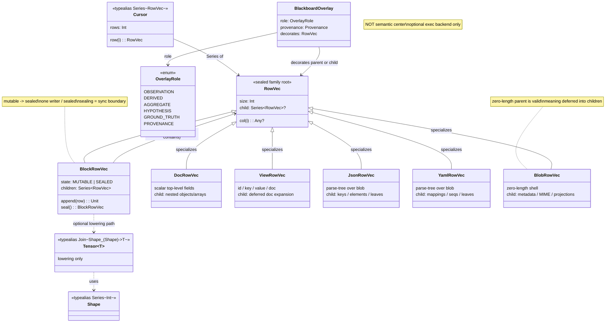

# Cursor: Before and After RowVec Family Model

## BEFORE — Cursor as flat rectangular rows

```mermaid
classDiagram
    direction TB

    class Series~T~ {
        <<typealias>>
        Int size
        (Int) -> T get
    }

    class Join~A_B~ {
        <<typealias>>
        A first
        B second
    }

    class RowVec {
        <<typealias Series~Join~Int_Any~~>>
        Int columns
        (Int) -> Any? col
    }

    class Cursor {
        <<typealias Series~RowVec~>>
        Int rows
        (Int) -> RowVec row
    }

    Series~T~ <|-- RowVec : specializes
    Series~T~ <|-- Cursor : specializes
    RowVec ..> Join~A_B~ : cell is Join(Int, Any?)

    note for Cursor "Flat. Rectangular.\nNo nesting. No families.\nEvery row same shape."
    note for RowVec "Any? columns only.\nNo lazy children.\nNo block boundary."
```

---

## AFTER — Cursor over RowVec family hierarchy (MiniDuck)



---

## Key Delta

| Aspect | Before | After |
|---|---|---|
| Cursor typedef | `Series<RowVec>` | `Series<RowVec>` (unchanged) |
| RowVec shape | flat `Any?` column bag | sealed family root with lazy `.child` |
| Nesting | none | arbitrary depth via `.child: Series<RowVec>?` |
| Block boundary | none | `BlockRowVec` mutable → sealed (DuckDB-style) |
| Locking | none | one writer per mutable block; sealed = read-many |
| Blob / doc / JSON | not modeled | `BlobRowVec`, `DocRowVec`, `JsonRowVec`, `YamlRowVec` |
| Blackboard | not connected | `BlackboardOverlay` decorates any family row |
| Zero-length rows | meaningless | first-class (deferred child meaning) |
| Tensor | not present | optional lowering only; `Shape = Series<Int>` |
| View expansion | flat result | `ViewRowVec` with deferred `doc` child |
