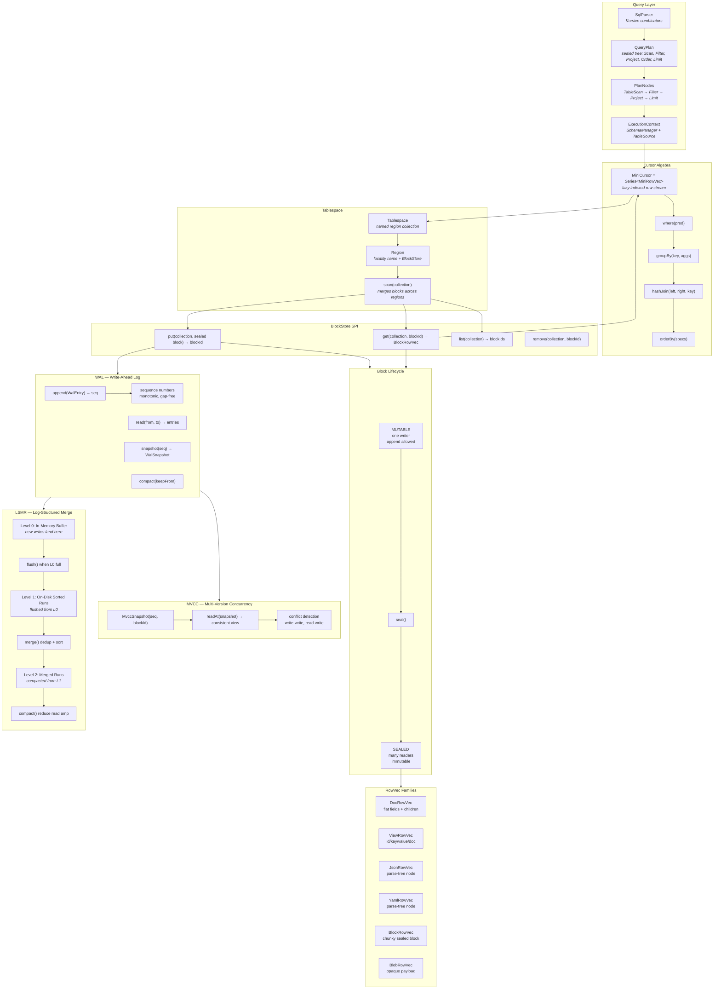

# MiniDuck Block-Store Architecture



## Data Flow

### Write Path
```
DocRowVec → BlockRowVec.append() → seal() → WAL.append() → BlockStore.put()
                  ↑                                    ↑
            MUTABLE state                    sequence number assigned
```

### Read Path
```
BlockStore.get() → BlockRowVec.child → MiniCursor → CursorOps → result
                                                        ↑
                                              where/groupBy/join/orderBy
```

### Recovery Path
```
WAL.readFrom(0) → replay entries → reconstruct BlockStore state
                                        ↓
                              MVCC snapshot at last durable seq
```

### Compaction Path
```
L0 (memory) → flush → L1 (disk runs)
L1 runs     → merge → L2 (merged runs)
WAL entries → compact → trim sequences older than snapshot
```

## Key Invariants

1. **Seal-before-put**: BlockStore never receives mutable blocks
2. **Append-only WAL**: Writes are sequenced, never reordered
3. **MVCC isolation**: Readers see a consistent snapshot at their sequence number
4. **LSMR read amplification**: Compaction reduces the number of runs to scan
5. **Block = sync boundary**: Sealing is the handoff from writer to readers
