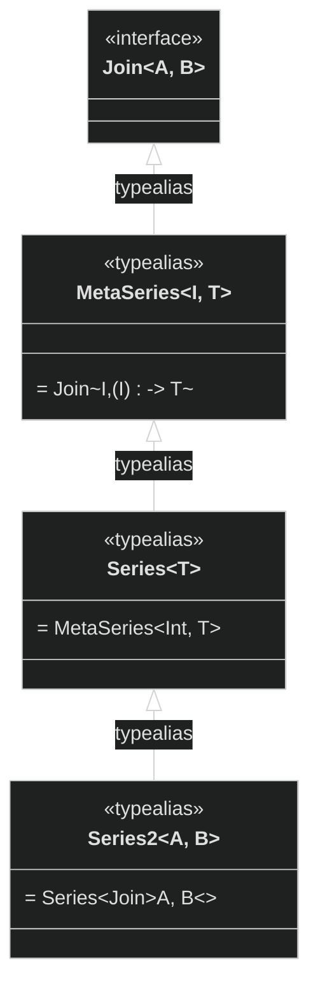
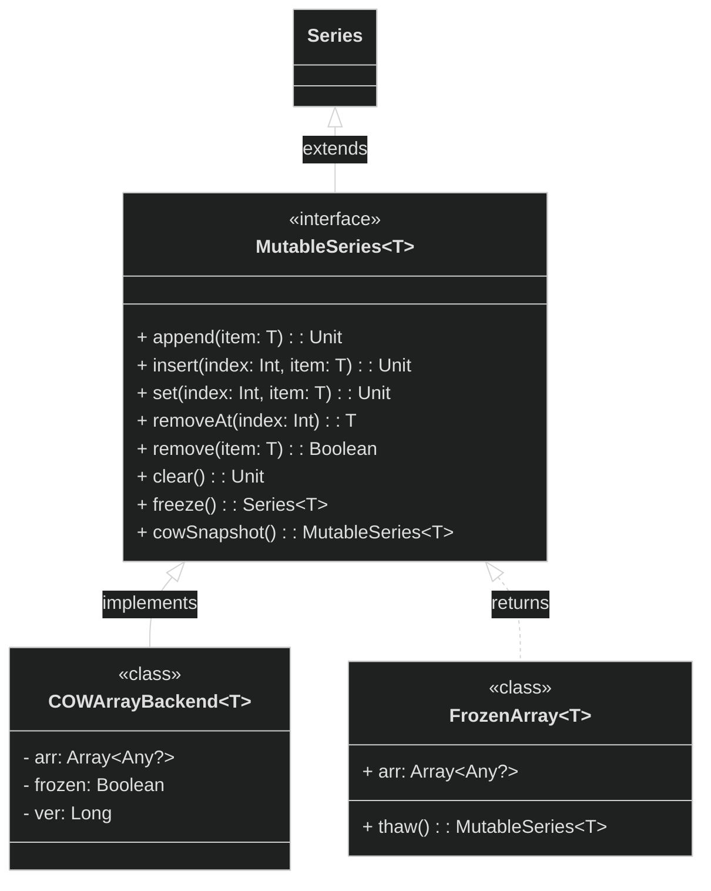
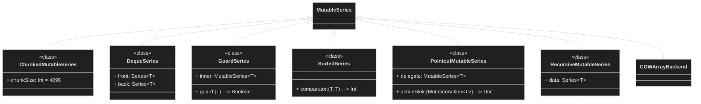
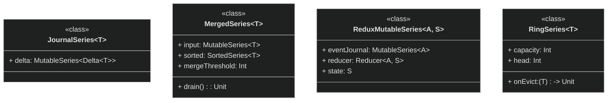

# MutableSeries Class Hierarchy

> TrikeShed mutable collections type algebra • kotlin multiplatform

## Type Alias Foundation

## Interface + Default Implementation

## Implementations with MutableSeries Base

## Standalone Implementations (No MutableSeries Base)

## Full Hierarchy Graph

```mermaid
%%{init: {"theme": "dark", "themeVariables": {"primaryColor": "#22d3ee", "edgeLabelBackground": "#020617", "tertiaryColor": "#1e293b"}}}%%
graph TD
    subgraph Foundation
        J["Join~A, B~<br/>lib/Join.kt:1"] --> MS["MetaSeries~I, T~<br/>= Join~I, (I)->T~"]
        MS --> S["Series~T~<br/>= MetaSeries~Int, T~"]
    end

    subgraph Interface
        S --> MT["MutableSeries~T~<br/>interface<br/>mutable/MutableSeries.kt:17"]
    end

    subgraph BaseImpls
        MT --> COW["COWArrayBackend~T~<br/>class<br/>MutableSeries.kt:62"]
        MT --> CHK["ChunkedMutableSeries<br/>class"]
        MT --> DEQ["DequeSeries<br/>class"]
        MT --> GRD["GuardSeries<br/>class"]
        MT --> SRT["SortedSeries<br/>class"]
        MT --> PCT["PointcutMutableSeries<br/>class"]
        MT --> REC["RecursiveMutableSeries<br/>class"]
    end

    subgraph Standalone
        JRN["JournalSeries<br/>class"]
        MRG["MergedSeries<br/>class<br/>+drain()"]
        RDX["ReduxMutableSeries<br/>class"]
        RNG["RingSeries<br/>class"]
    end

    subgraph Snapshot
        COW --> FRZ["FrozenArray~T~<br/>class<br/>MutableSeries.kt:177"]
    end

    style J fill:#4c1d95,stroke:#a78bfa
    style MS fill:#4c1d95,stroke:#a78bfa
    style S fill:#4c1d95,stroke:#a78bfa
    style MT fill:#881337,stroke:#fb7185
    style COW fill:#064e3b,stroke:#34d399
    style CHK fill:#064e3b,stroke:#34d399
    style DEQ fill:#064e3b,stroke:#34d399
    style GRD fill:#064e3b,stroke:#34d399
    style SRT fill:#064e3b,stroke:#34d399
    style PCT fill:#064e3b,stroke:#34d399
    style REC fill:#064e3b,stroke:#34d399
    style JRN fill:#78350f,stroke:#fbbf24
    style MRG fill:#78350f,stroke:#fbbf24
    style RDX fill:#78350f,stroke:#fbbf24
    style RNG fill:#78350f,stroke:#fbbf24
    style FRZ fill:#4c1d95,stroke:#a78bfa
```

## Summary

| Category | Count | Files |
|----------|-------|-------|
| Foundation types | 3 | lib/Join.kt |
| Interface | 1 | mutable/MutableSeries.kt:17 |
| Extends MutableSeries | 6 | Chunked, Deque, Guard, Sorted, Pointcut, Recursive |
| Standalone | 4 | Journal, Merged, Redux, Ring |
| Snapshots | 1 | FrozenArray |

## Source References

- `lib/Join.kt:1` — `interface Join<A, B>`
- `lib/Join.kt:7` — `typealias Series<T> = MetaSeries<Int, T>`
- `mutable/MutableSeries.kt:17` — `interface MutableSeries<T> : Series<T>`
- `mutable/MutableSeries.kt:62` — `class COWArrayBackend<T>`
- `mutable/MutableSeries.kt:177` — `class FrozenArray<T>`