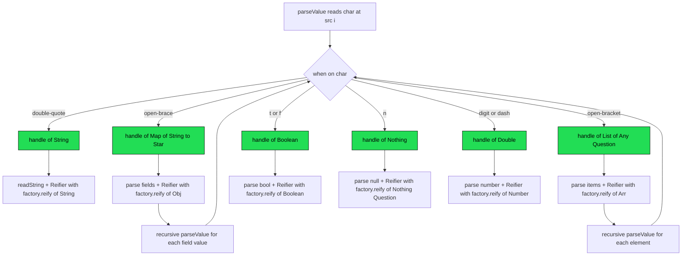

# Compile-Time Dispatch for JSON Parser — Full Rewrite

## Goal

Rewrite [`Json.kt`](../libs/doubledispatch/src/commonMain/kotlin/borg/trikeshed/doubledispatch/Json.kt) so that **all** dispatch — from character scan through `Factory.reify()` — is compile-time resolved. The `handle<R : T>` overloads become the single unified dispatch point containing parse logic AND Reifier creation. No separate `reifyString`/`reifyNumber`/etc. factory functions, no separate `parseStringValue`/`parseNumber`/etc. methods.

## What Gets Eliminated

| Current artifact | Lines | Why eliminate |
|------------------|-------|---------------|
| `reifyString<R, Type>()` | 132–134 | Logic inlined into `handle<R : String>` |
| `reifyNumber<R, Type>()` | 136–138 | Logic inlined into `handle<R : Double>` |
| `reifyBoolean<R, Type>()` | 140–142 | Logic inlined into `handle<R : Boolean>` |
| `reifyObject<R, Type>()` | 144–146 | Logic inlined into `handle<R : Map<String, *>>` |
| `reifyArray<R, Type>()` | 148–150 | Logic inlined into `handle<R : List<Any?>>` |
| `reifyNull<R, Type>()` | 152–154 | Logic inlined into `handle<R : Nothing>` |
| `parseStringValue()` | 201–206 | Merged into `handle<R : String>` |
| `parseNumber()` | 208–239 | Merged into `handle<R : Double>` |
| `parseBoolean()` | 241–258 | Merged into `handle<R : Boolean>` |
| `parseNull()` | 260–267 | Merged into `handle<R : Nothing>` |
| `parseObject()` | 299–333 | Merged into `handle<R : Map<String, *>>` |
| `parseArray()` | 269–297 | Merged into `handle<R : List<Any?>>` |
| Broken `Recognizer` lambda | 191 | Replaced by `handle<T>` call |

## What Stays

| Artifact | Why keep |
|----------|----------|
| `Region` inline class | Core value type, works correctly |
| `Reifier<R, Type>` inline class | Core lazy wrapper, works correctly |
| `Obj<R>`, `Arr<R>` typealiases | Used by Factory and Reifier |
| `Factory<R>` interface | User-facing dispatch target — 6 overloads selected by static argument type |
| `JsonFactory` | Reference Factory implementation |
| `MemoizingReifier` | Caching layer, works correctly |
| `RegionScanner` | Scan + decode orchestration, works correctly |
| `produce()` | Entry point, works correctly |
| `Parser` raw helpers: `readString()`, `skipWs()`, `expect()`, `tryChar()`, `expectWord()`, `peek()`, `digits()`, `fail()` | Low-level parse primitives used by handle functions |

## New Architecture

### Forwarder / Recognizer Types

```kotlin
/** Forwarder: the simple parse result — takes Region, returns typed value */
typealias Forwarder<R> = (Region) -> R

/** Recognizer: KClass-phantom wrapper around Forwarder.
 *  (KClass<R>, Region) -> R  forwards to  (Region) -> R
 *  KClass is phantom — used only for compile-time overload resolution. */
typealias Recognizer<R> = (KClass<R>, Region) -> R

/** Lift a Forwarder into a Recognizer — strips phantom KClass, forwards Region */
fun <R> recognize(forwarder: Forwarder<R>): Recognizer<R> = { _, region -> forwarder(region) }
```

### The 6 Handle Overloads — Single Unified Dispatch Point

Each `handle<R : T>` overload:
1. **Parses** the value for its type using `Parser` primitives
2. **Creates** a `Reifier` that calls the correct `Factory.reify()` overload
3. **Reports** to the collector via `(Region, Reifier) -> Unit`
4. Is selected at **compile time** by the type parameter constraint

```kotlin
// ═══════════════════════════════════════════════════════════
// String dispatch — handle<R : String>
// Compiler selects this when parseValue calls handle<String>(collector)
// ═══════════════════════════════════════════════════════════
inline fun <R : String> handle(
    collector: ((Region, Reifier<R, *>) -> Unit)?
): Reifier<R, String> {
    val (value, at) = readString()
    val r: Reifier<R, String> = Reifier { factory ->
        factory.reify(value, at)  // Factory.reify(String, Region) — compile-time
    }
    collector?.invoke(at, r)
    return r
}

// ═══════════════════════════════════════════════════════════
// Boolean dispatch — handle<R : Boolean>
// ═══════════════════════════════════════════════════════════
inline fun <R : Boolean> handle(
    collector: ((Region, Reifier<R, *>) -> Unit)?
): Reifier<R, Boolean> {
    val start = i
    val value: Boolean = if (src.startsWith("true", i)) {
        i += 4; true
    } else if (src.startsWith("false", i)) {
        i += 5; false
    } else fail("expected boolean")
    val at = Region.of(start, i)
    val r: Reifier<R, Boolean> = Reifier { factory ->
        factory.reify(value, at)  // Factory.reify(Boolean, Region) — compile-time
    }
    collector?.invoke(at, r)
    return r
}

// ═══════════════════════════════════════════════════════════
// Number dispatch — handle<R : Double>
// ═══════════════════════════════════════════════════════════
inline fun <R : Double> handle(
    collector: ((Region, Reifier<R, *>) -> Unit)?
): Reifier<R, Number> {
    val start = i
    if (peek('-')) i++
    digits("number")
    if (peek('.')) { i++; digits("fraction") }
    if (peek('e') || peek('E')) {
        i++
        if (peek('+') || peek('-')) i++
        digits("exponent")
    }
    val end = i
    val raw = src.substring(start, end)
    val at = Region.of(start, end)
    val r: Reifier<R, Number> = Reifier { factory ->
        val num: Number = if (raw.any { it == '.' || it == 'e' || it == 'E' }) raw.toDouble() else raw.toLong()
        factory.reify(num, at)  // Factory.reify(Number, Region) — compile-time
    }
    collector?.invoke(at, r)
    return r
}

// ═══════════════════════════════════════════════════════════
// Null dispatch — handle<R : Nothing>
// ═══════════════════════════════════════════════════════════
inline fun <R : Nothing> handle(
    collector: ((Region, Reifier<R, *>) -> Unit)?
): Reifier<R, Nothing?> {
    val start = i
    expectWord("null")
    val at = Region.of(start, i)
    val r: Reifier<R, Nothing?> = Reifier { factory ->
        factory.reify(null, at)  // Factory.reify(Nothing?, Region) — compile-time
    }
    collector?.invoke(at, r)
    return r
}

// ═══════════════════════════════════════════════════════════
// Object dispatch — handle<R : Map<String, *>>
// Recursive: field values go through parseValue → handle<T>
// ═══════════════════════════════════════════════════════════
inline fun <R : Map<String, *>> handle(
    collector: ((Region, Reifier<R, *>) -> Unit)?
): Reifier<R, Obj<R>> {
    val start = i
    expect('{')
    val fields = LinkedHashMap<String, Reifier<R, *>>()
    skipWs()
    if (tryChar('}')) {
        val at = Region.of(start, i)
        val r: Reifier<R, Obj<R>> = Reifier { factory -> factory.reify(fields, at) }
        collector?.invoke(at, r)
        return r
    }
    while (true) {
        skipWs()
        val (key, _) = readString()
        skipWs()
        expect(':')
        fields[key] = parseValue<R>(collector)  // recursive — goes through handle<T>
        skipWs()
        if (tryChar(',')) continue
        expect('}')
        break
    }
    val at = Region.of(start, i)
    val r: Reifier<R, Obj<R>> = Reifier { factory -> factory.reify(fields, at) }
    collector?.invoke(at, r)
    return r
}

// ═══════════════════════════════════════════════════════════
// Array dispatch — handle<R : List<Any?>>
// Recursive: elements go through parseValue → handle<T>
// ═══════════════════════════════════════════════════════════
inline fun <R : List<Any?>> handle(
    collector: ((Region, Reifier<R, *>) -> Unit)?
): Reifier<R, Arr<R>> {
    val start = i
    expect('[')
    val items = ArrayList<Reifier<R, *>>()
    skipWs()
    if (tryChar(']')) {
        val at = Region.of(start, i)
        val r: Reifier<R, Arr<R>> = Reifier { factory -> factory.reify(items, at) }
        collector?.invoke(at, r)
        return r
    }
    while (true) {
        items += parseValue<R>(collector)  // recursive — goes through handle<T>
        skipWs()
        if (tryChar(',')) continue
        expect(']')
        break
    }
    val at = Region.of(start, i)
    val r: Reifier<R, Arr<R>> = Reifier { factory -> factory.reify(items, at) }
    collector?.invoke(at, r)
    return r
}
```

### parseValue — Compile-Time Routed

```kotlin
fun <R> parseValue(collector: ((Region, Reifier<R, *>) -> Unit)? = null): Reifier<R, *> {
    skipWs()
    if (i >= src.length) fail("expected value")

    return when (src[i]) {
        '"'              -> handle<String>(collector)
        '{'              -> handle<Map<String, *>>(collector)
        '['              -> handle<List<Any?>>(collector)
        't', 'f'         -> handle<Boolean>(collector)
        'n'              -> handle<Nothing>(collector)
        '-', in '0'..'9' -> handle<Double>(collector)
        else             -> fail("expected value")
    }
}
```

## Dispatch Chain — End to End



## Files to Modify

| File | Change |
|------|--------|
| [`Json.kt`](../libs/doubledispatch/src/commonMain/kotlin/borg/trikeshed/doubledispatch/Json.kt) | Full rewrite: eliminate `reify*` functions and `parse*` methods, implement 6 `handle<R : T>` forwarders with inline parse + Reifier logic, fix `parseValue` |
| [`DoubleDispatchTest.kt`](../libs/doubledispatch/src/commonTest/kotlin/borg/trikeshed/doubledispatch/DoubleDispatchTest.kt) | Add JSON parsing tests covering all 6 type branches through the new dispatch chain |

## Implementation Order

1. Add `Forwarder<R>` and `Recognizer<R>` typealiases + `recognize()` helper
2. Implement `handle<R : String>` — simplest, uses `readString()`
3. Implement `handle<R : Boolean>` — simple, inline bool parsing
4. Implement `handle<R : Double>` — number parsing with digit scanning
5. Implement `handle<R : Nothing>` — null literal
6. Implement `handle<R : Map<String, *>>` — recursive object parsing
7. Implement `handle<R : List<Any?>>` — recursive array parsing
8. Rewrite `parseValue` to route through `handle<T>` overloads
9. Delete `reifyString`/`reifyNumber`/`reifyBoolean`/`reifyNull`/`reifyObject`/`reifyArray`
10. Delete `parseStringValue`/`parseNumber`/`parseBoolean`/`parseNull`/`parseObject`/`parseArray`
11. Add comprehensive tests
12. Validate build across JVM/JS/Wasm targets
