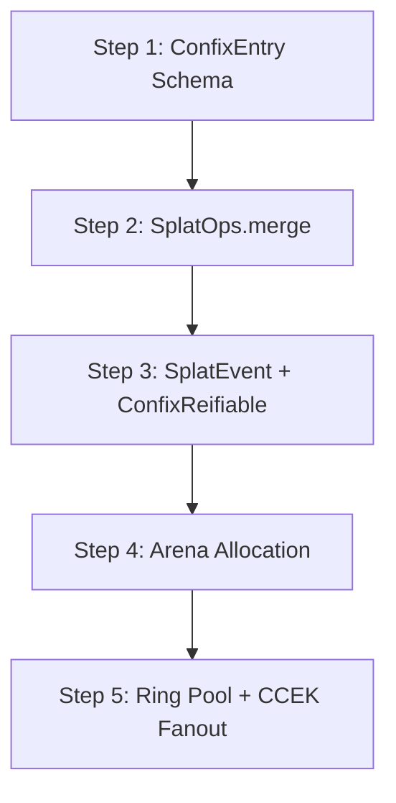
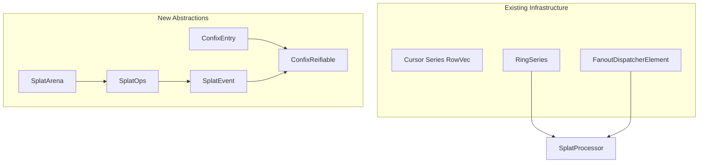

# Splat-n Dimensional Encoding: Implementation Plan

## Context Analysis

### Existing Components in `libs/motion-estimation`

| Component | Location | Purpose |
|-----------|----------|---------|
| `ParameterGaussian` | `GaussianSplat.kt:20` | Mean, scale, rotation, opacity, localTransform |
| `MutableParameterGaussian` | `GaussianSplat.kt:71` | Gradient accumulation |
| `SpatialHashGrid` | `GaussianSplat.kt:172` | k-NN search in feature space |
| `SplatModel<Context, T>` | `Splat.kt:16` | Motion model interface |
| `Cursor` | `cursor/Cursor.kt:103` | `Series<RowVec>` — columnar algebra |
| `RowVec` | `cursor/Cursor.kt:93` | `Series2<Any?, ColumnMeta↻>` |
| `RingSeries` | `lib/RingSeries.kt:19` | Fixed-capacity ring buffer |
| `FanoutDispatcherElement` | `context/FanoutDispatcherElement.kt` | CCEK fanout dispatcher |

### Missing Abstractions (Gap Analysis)

1. **`ConfixReifiable`** — Not found. Must be created as new interface
2. **Arena allocator** — Not found. `RingSeries` is close but not a general-purpose arena
3. **`SplatEvent` sealed hierarchy** — Not found
4. **`SplatOps` interface** — Not found
5. **`ConfixEntry`** — Partial in `ConfixOracleService`, but not a general-purpose entry type

---

## Proposed Implementation Order



### Step 1: ConfixEntry Schema for Splat

**File**: `libs/motion-estimation/src/commonMain/kotlin/borg/trikeshed/splat/SplatSchema.kt`

```kotlin
package borg.trikeshed.splat

import borg.trikeshed.lib.Series

/**
 * ConfixEntry schema for n-dimensional Splat.
 * Maps to existing ParameterGaussian fields.
 */
data class SplatSchema(
    val id: Long, // stable identity
    val position: Series<Double>,       // n-dimensional mean (featDim)
    val scale: Series<Double>,         // diagonal scale vector
    val rotation: Series<Series<Double>>, // rotation matrix R (row-major)
    val opacity: Double,               // importance weight ∈ [0,1]
    val attributes: ConfixEntry? = null // color, motion vector, uncertainty
)

/** Minimal ConfixEntry for attribute extension */
interface ConfixEntry {
    fun get(key: String): Any?
    fun put(key: String, value: Any?): ConfixEntry
}
```

**Rationale**: Establishes the data model before implementing operations. Maps directly to existing `ParameterGaussian` fields.

---

### Step 2: SplatOps.merge with Idempotent Contract

**File**: `libs/motion-estimation/src/commonMain/kotlin/borg/trikeshed/splat/SplatOps.kt`

```kotlin
package borg.trikeshed.splat

/**
 * SplatOps interface with idempotent operation contracts.
 * 
 * Idempotence properties:
 * - update(id, changes) is idempotent w.r.t. same changes
 * - merge(a, b) is commutative: merge(a,b) == merge(b,a)
 * - merge(a, b) is associative: merge(merge(a,b), c) == merge(a, merge(b,c))
 * - cull(p) is idempotent: calling twice with same predicate removes nothing second time
 */
interface SplatOps {
    /** Idempotent update — returns null if no-op */
    fun update(id: Long, changes: ConfixEntry): SplatEvent?
    
    /** Idempotent merge — order-independent */
    fun merge(other: SplatSet): Pair<SplatSet, List<SplatEvent>>
    
    /** Idempotent cull */
    fun cull(predicate: (Splat) -> Boolean): Pair<SplatSet, List<SplatEvent>>
    
    /** Motion update with version tracking for idempotence */
    fun applyMotion(id: Long, delta: Series<Double>, version: Long): SplatEvent?
}

/** SplatSet as Cursor<Splat> */
typealias SplatSet = Cursor<Splat>
```

**Implementation Note**: Start with simple set semantics (union by id), add probabilistic merge later.

---

### Step 3: SplatEvent + ConfixReifiable

**File**: `libs/motion-estimation/src/commonMain/kotlin/borg/trikeshed/splat/SplatEvent.kt`

```kotlin
package borg.trikeshed.splat

/**
 * SplatEvent sealed hierarchy — ConfixReifiable for multi-flavor reification.
 * 
 * Flavors:
 * - Compact binary (ring pool path)
 * - Columnar (blackboard path)  
 * - Classfile (provenance path)
 */
sealed class SplatEvent : ConfixReifiable {
    abstract val timestampNanos: Long
    
    data class Created(
        val splat: Splat,
        override val timestampNanos: Long
    ) : SplatEvent()
    
    data class Updated(
        val id: Long,
        val changes: ConfixEntry,
        override val timestampNanos: Long
    ) : SplatEvent()
    
    data class Culled(
        val id: Long,
        val reason: String,
        override val timestampNanos: Long
    ) : SplatEvent()
    
    data class MotionApplied(
        val id: Long,
        val delta: Series<Double>,
        val version: Long,
        override val timestampNanos: Long
    ) : SplatEvent()
}

/**
 * ConfixReifiable interface — entities that can be reified into multiple flavors.
 * Maps to the existing ConfixOracleService reification concept.
 */
interface ConfixReifiable {
    fun reify(flavor: ReificationFlavor): Any
    
    enum class ReificationFlavor {
        COMPACT_BINARY,  // ring pool path
        COLUMNAR,        // blackboard path
        CLASSFILE        // provenance path
    }
}
```

---

### Step 4: Arena-Backed Allocation

**File**: `libs/motion-estimation/src/commonMain/kotlin/borg/trikeshed/splat/SplatArena.kt`

```kotlin
package borg.trikeshed.splat

/**
 * Arena-backed allocation for temporary splat buffers.
 * 
 * Design:
 * - Slab allocator with chunk size4096 bytes (cache-line aligned)
 * - Resets on batch boundary or after merge+event flush
 * - Eliminates per-splat allocations in hot path
 */
class SplatArena(capacity: Int = 1024 * 1024) {
    private val slab: ByteArray = ByteArray(capacity)
    private var offset: Int = 0
    
    fun allocate(size: Int): Long {
        val aligned = (size + 7) and -8 //8-byte alignment
        require(offset + aligned <= capacity) { "Arena exhausted" }
        val ptr = offset.toLong()
        offset += aligned
        return ptr
    }
    
    fun reset() { offset = 0 }
}
```

---

### Step 5: Ring Pool + CCEK Fanout Integration

**File**: `libs/motion-estimation/src/commonMain/kotlin/borg/trikeshed/splat/SplatProcessor.kt`

```kotlin
package borg.trikeshed.splat

import borg.trikeshed.lib.RingSeries
import borg.trikeshed.userspace.context.FanoutDispatcherElement

/**
 * Frame processor wiring SplatEvents into ring pool + CCEK fanout.
 */
class SplatProcessor(
    private val arena: SplatArena,
    private val ringPool: RingSeries<SplatEvent>,
    private val fanout: FanoutDispatcherElement
) {
    fun processFrame(newObservations: SplatSet) {
        val (updatedSet, events) = currentSet.merge(newObservations)
        
        events.forEach { event ->
            val timing = captureNanos()
            val enriched = event.withTimestamp(timing)
            
            ringPool.add(enriched)
            fanout.publish(SplatSignal(enriched))
            blackboard.upsert(enriched)
        }
        
        currentSet = updatedSet
        arena.reset()
    }
}
```

---

## Dependency Graph



---

## Eliminated Patterns

The proposal eliminates:
- ❌ Ad-hoc `MutableList<Splat>` or raw arrays outside Confix
- ❌ Direct mutation of splat fields without `update()`
- ❌ Separate serialization code (routes through Confix reification)
- ❌ One-off timing collection bypassing ring event pools

---

## Questions for User

1. **Priority**: Should we start with Step 1 (schema) or Step 2 (merge algebra)?
2. **Arena backend**: JVM off-heap `ByteBuffer`, slab allocator, or something else?
3. **Probabilistic merge**: Is this needed in initial implementation or deferred?
4. **Existing ParameterGaussian**: Should it be refactored to use new `Splat` type?